# SmileX 学习路线与知识图谱

面向 Java 开发者转型 Python 量化分析的完整学习指南。每个模块包含前置知识、核心概念、学习主题、实践练习和知识图谱。

> **阅读建议**：先看第一章的全局知识图谱建立整体认知，再按需阅读感兴趣的模块。第三章提供了 12 周分阶段学习计划供参考。
>
> **Mermaid 图表**：本文档中的流程图使用 Mermaid 语法，GitHub 和 VS Code（安装 Markdown Preview Mermaid 插件）均可渲染。

---

## 第一章：全局知识图谱

### Java → Python 对照速查

| Java 概念 | Python / 本项目对应 |
|-----------|-------------------|
| Spring Boot + Thymeleaf | Streamlit（无需前后端分离，Python 直接写 UI）|
| Spring Data JPA + H2/MySQL | SQLite + pandas `to_sql()`/`read_sql()` |
| Quartz Scheduler | APScheduler `BackgroundScheduler` |
| OkHttp / Retrofit | AKShare（封装好的金融数据 API）|
| Jackson / Gson | pandas DataFrame（结构化数据处理）|
| JUnit | pytest |
| Maven / Gradle | uv（Python 包管理器）|
| Stream + Record 列表操作 | pandas DataFrame 操作 |

### 系统架构知识图谱

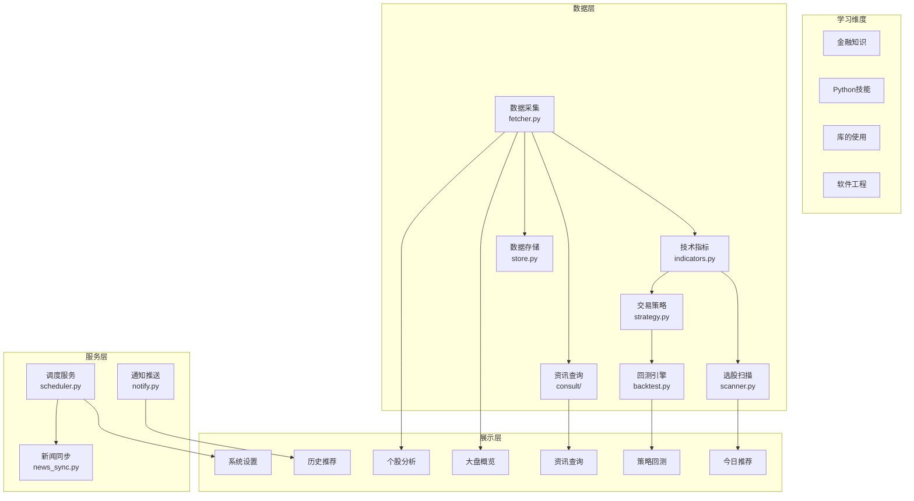

---

## 第二章：模块学习路线

### 2.1 大盘概览

> **对应代码**：`dashboard/pages/01_大盘概览.py`、`smilex/store.py`（`sync_index_data`、`query_market_stats`）、`smilex/fetcher.py`（`index_daily`、`realtime_quote`）、`smilex/scheduler.py`（`sync_market_overview`）
>
> **难度**：入门

#### 前置知识

- 了解股票市场基本概念（指数、涨跌）
- Python 基础语法（变量、字典、列表）
- Streamlit 基础组件（`st.metric`、`st.columns`）

#### 核心概念

- **上证指数**（000001）：上海证券交易所综合指数
- **深证成指**（399001）：深圳证券交易所成分指数
- **创业板指**（399006）：创业板市场指数
- **涨跌家数**：上涨/下跌/平盘的股票数量，反映市场广度
- **涨跌停统计**：涨停（涨幅≥9.9%）和跌停（跌幅≤-9.9%）的股票数量

#### 学习主题

1. **A股市场结构**：上海/深圳交易所、主板/创业板/科创板的区别
2. **指数编制方法**：价格加权、市值加权、等权指数
3. **市场情绪指标**：涨跌比率（advance-decline ratio）、涨停家数、市场广度
4. **AKShare 指数数据**：`ak.stock_zh_index_daily()` 获取指数 K 线
5. **AKShare 实时行情**：`ak.stock_zh_a_spot_em()` 获取全市场快照
6. **Plotly 折线图**：`go.Scatter` 绘制指数走势
7. **Streamlit 布局**：`st.columns()` 多列布局 + `st.metric()` 指标卡片

#### 知识点详解

**A股交易制度：**
- 交易时间：周一至周五 9:30-11:30（上午盘）、13:00-15:00（下午盘）
- T+1 交割：当日买入的股票次日才能卖出
- 涨跌停限制：主板 ±10%，创业板/科创板 ±20%
- 最小交易单位：1 手 = 100 股
- 集合竞价：9:15-9:25（开盘）、14:57-15:00（收盘）

**四大板块区别：**
| 板块 | 交易所 | 代码开头 | 涨跌停 | 上市门槛 |
|------|--------|---------|--------|---------|
| 主板 | 上交所/深交所 | 60/00 | ±10% | 盈利要求高 |
| 创业板 | 深交所 | 300 | ±20% | 成长型企业 |
| 科创板 | 上交所 | 688 | ±20% | 科技创新企业 |
| 北交所 | 北交所 | 8 | ±30% | 专精特新 |

**指数编制三要素：**
1. **样本选择**：全样本（上证综指）vs 成分股（沪深300）
2. **加权方式**：市值加权（主流）、等权、价格加权
3. **调整机制**：定期调整（半年/季度）+ 临时调整

**市场广度指标解读：**
- 涨跌比率 > 1.5 → 市场强势，多数股票上涨
- 涨跌比率 < 0.5 → 市场弱势，多数股票下跌
- 涨停家数激增 → 市场情绪亢奋，需警惕短期过热

#### 学习资料

**入门教程：**
- [上交所投资者教育 — 股市新手村](https://edu.sse.com.cn/) — 交易所官方教程，权威可靠
- [平安证券投资者教育基地](https://edu.stock.pingan.com/) — 从开户到交易的免费视频教程
- [知乎 2026 股市分析思路](https://zhuanlan.zhihu.com/p/1999423823896913760) — K线、看盘、财报、策略的完整知识框架

**Streamlit 可视化：**
- [st.metric API 文档](https://docs.streamlit.io/develop/api-reference/data/st.metric) — 指标卡片组件
- [st.columns API 文档](https://docs.streamlit.io/develop/api-reference/layout/st.columns) — 多列布局
- [Plotly 折线图教程](https://plotly.com/python/line-and-scatter/) — go.Scatter 用法

**视频课程：**
- [B站 — Streamlit 可视化看板教程](https://www.bilibili.com/video/BV1YM4y1A7jt/) — 数据看板搭建实战
- [B站 — Streamlit + Plotly 制作数据看板](https://www.bilibili.com/video/BV1Ks4y1g7m3/) — 完整项目演示

#### 实践练习

1. 阅读 `scheduler.py` 中的 `sync_market_overview()`，追踪完整数据流：API → 统计 → SQLite → 页面展示
2. 修改 `01_大盘概览.py`，添加第四个指数卡片（如沪深 300，代码 000300）
3. 在市场统计区域新增一个"涨跌比率"指标（上涨家数 / 下跌家数）

#### 知识图谱

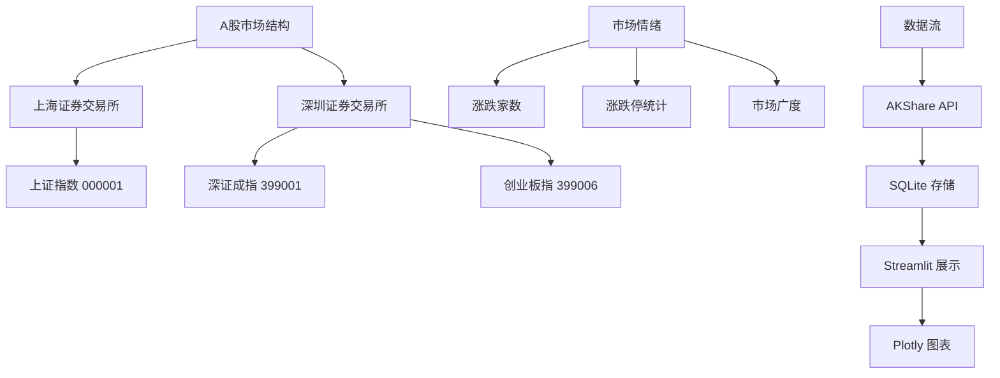

---

### 2.2 每日选股

> **对应代码**：`smilex/scanner.py`（`daily_scan`、`_evaluate`、`_should_skip`）、`smilex/indicators.py`（`all_indicators`）、`dashboard/pages/02_今日推荐.py`
>
> **难度**：中级

#### 前置知识

- 技术指标基础（MA、MACD、RSI、布林带、量比）——见 2.9 节
- pandas DataFrame 操作（筛选、排序、聚合）
- 评分/排序系统的设计思路

#### 核心概念

- **多因子评分模型**：多个独立条件各自赋分，总分排序筛选
- **均线多头排列**：MA5 > MA10 > MA20 > MA60，表示多头趋势（30 分）
- **MACD 金叉**：DIF > DEA，短期趋势走强（20 分）
- **量比 > 1.5**：当前成交量大于 5 日均量 1.5 倍，表示放量（20 分）
- **布林中轨上方**：收盘价高于布林带中轨，确认上升趋势（15 分）
- **RSI 适中区间**（40-70）：既不超买也不超卖（15 分）
- **过滤规则**：排除 ST/退市、停牌、上市不足 60 天、涨跌停股票

#### 学习主题

1. **量化选股方法论**：多因子模型、评分权重设计、条件组合
2. **技术形态识别**：均线排列、金叉/死叉、放量/缩量
3. **pandas 滚动窗口**：`.rolling(window=N).mean()` 计算移动平均
4. **评分系统设计**：权重分配、阈值选择、结果排序
5. **过滤规则设计**：业务逻辑驱动的数据清洗

#### 知识点详解

**多因子选股模型原理：**
- 本质：将多个独立的选股条件（因子）按权重组合打分，综合排名
- 因子分类：估值因子（PE/PB）、质量因子（ROE）、动量因子（涨跌幅）、技术因子（MA/MACD）
- SmileX 的 5 因子模型：均线排列(30) + MACD金叉(20) + 量比(20) + 布林带(15) + RSI(15) = 满分 100
- 进阶方向：因子有效性检验（IC/IR 值）、因子权重优化（等权/优化加权）、因子中性化

**评分权重设计思路：**
- 均线排列（30 分）：趋势是技术分析核心，多头排列意味着多个周期一致看多
- MACD 金叉（20 分）：趋势确认信号，但滞后性强，需配合其他因子
- 量比（20 分）：量价配合是技术分析基石，放量突破更可靠
- 布林带（15 分）：辅助确认趋势强度，站上中轨=偏多
- RSI 适中（15 分）：排除极端区域（超买/超卖），保留合理空间

**常见选股误区：**
- 单一指标决策：任何指标都有失效场景，必须多因子组合
- 忽略量价配合：价格信号无放量支撑 = 可靠性低
- 过度拟合历史数据：回测收益极高 ≠ 实盘有效
- 因子过多：5-10 个精选因子优于堆砌 50 个因子
- 忽略因子相关性：MACD 和 MA 都基于均线，存在共线性

**pandas 核心操作速查：**

| 操作 | 代码 | 说明 |
|------|------|------|
| 滚动均值 | `df["close"].rolling(5).mean()` | MA5 |
| 条件筛选 | `df[df["score"] > 50]` | 评分过滤 |
| 排序 | `df.sort_values("score", ascending=False)` | 按分数降序 |
| 重置索引 | `df.reset_index(drop=True)` | 排序后重建索引 |
| 列拼接 | `"；".join(reasons)` | 评分理由合并 |

#### 学习资料

**多因子模型：**
- [BigQuant 多因子选股模型代码](https://bigquant.com/wiki/topic/4d35240c98) — 从因子分析到组合构建的完整代码
- [国信证券多因子策略原理（PDF）](https://www3.guosen.com.cn/guosen/newxwfiles/upload/2020/02/17/ba911431.pdf) — 机构级理论入门
- [51CTO Python 多因子选股教程](https://blog.51cto.com/u_16175508/6916310) — 面向开发者的代码教程

**视频课程：**
- [B站 — Python 量化交易零基础教程（426 集）](https://www.bilibili.com/video/BV1z5kfBKE4Z/) — 最全量化入门
- [B站 — 2025 Python 金融分析实战](https://www.bilibili.com/video/BV1YFcbe8E8X/) — 时间序列到因子选股

**pandas 数据处理：**
- [利用 Pandas 做股票数据分析](https://pandas.liuzaoqi.com/doc/chapter6/%E8%82%A1%E7%A5%A8%E6%95%B0%E6%8D%AE%E5%88%86%E6%9E%90.html) — 真实股票数据操作演示
- [菜鸟教程 — Pandas 股票数据分析](https://www.runoob.com/pandas/pandas-stock.html) — 经典入门

**避坑指南：**
- [量化交易员避坑指南（知乎）](https://zhuanlan.zhihu.com/p/1929126085762745014) — 平台选择和策略开发注意事项
- [从零构建第一个量化策略（博客园）](https://www.cnblogs.com/mthoutai/p/19670969) — 完整闭环实战

#### 实践练习

1. 阅读 `scanner.py` 的 `_evaluate()` 函数（第 64-108 行），追踪每个评分规则如何对应指标值
2. 修改评分权重（如将均线排列从 30 分调为 25 分），新增一个 KDJ 评分规则
3. 在 `_should_skip()` 中新增一条过滤规则：排除股价低于 5 元的股票
4. 用少量股票（如 10 只）运行 `daily_scan()`，观察评分和排序结果

#### 知识图谱

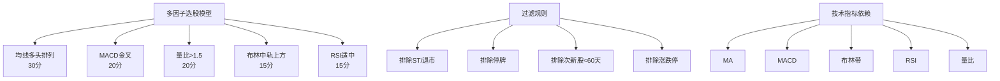

---

### 2.3 个股分析

> **对应代码**：`dashboard/pages/03_个股分析.py`、`smilex/fetcher.py`（`daily_history`）、`smilex/indicators.py`（`all_indicators`）
>
> **难度**：中级

#### 前置知识

- K 线图（蜡烛图）基本读法：开盘、收盘、最高、最低
- 技术指标的视觉含义（均线系统、MACD 柱状图）
- Plotly 图表基础

#### 核心概念

- **OHLCV 数据**：Open/High/Low/Close/Volume 五项核心行情数据
- **K 线图**：以红涨绿跌（中国市场惯例，与西方相反）绘制蜡烛图
- **均线系统**：MA5/10/20/60 叠加在 K 线图上
- **MACD 副图**：DIF 线、DEA 线、红绿柱状图
- **成交量副图**：底部柱状图展示成交量变化
- **前复权（qfq）**：以最新价格为基准向前调整历史价格，保证连续性

#### 学习主题

1. **日本蜡烛图**：阳线/阴线、上下影线、实体长度的含义
2. **均线系统**：短周期（MA5）反映短期趋势，长周期（MA60）反映长期趋势
3. **MACD 指标构建**：快线 DIF、慢线 DEA、柱状图的计算和含义
4. **Plotly 子图布局**：`make_subplots(rows=3, shared_xaxes=True)` 创建多行图表
5. **Plotly 蜡烛图**：`go.Candlestick` 配置开高低收
6. **A股特有惯例**：红涨绿跌、涨跌停板制度、T+1 交易

#### 知识点详解

**K 线（蜡烛图）读图要点：**
- 阳线（涨）：收盘 > 开盘，实体为红色（中国惯例）或绿色（西方惯例）
- 阴线（跌）：收盘 < 开盘，实体为绿色（中国）或红色（西方）
- 上影线：最高价与实体上端的距离，越长说明上方抛压越大
- 下影线：最低价与实体下端的距离，越长说明下方支撑越强
- 十字星：开盘≈收盘，表示多空力量平衡，可能是反转信号

**均线系统实战解读：**
| 均线 | 周期 | 含义 |
|------|------|------|
| MA5 | 1 周 | 超短期趋势，日内交易者关注 |
| MA10 | 2 周 | 短期趋势，与 MA5 的金叉/死叉有参考价值 |
| MA20 | 1 月 | 中期趋势，常被称为"月线"，是波段交易的分水岭 |
| MA60 | 1 季 | 长期趋势，站上 MA60 通常被认为是中期上升趋势 |

**多头排列 vs 空头排列：**
- 多头排列：MA5 > MA10 > MA20 > MA60 → 各周期趋势一致向上 → 看涨
- 空头排列：MA5 < MA10 < MA20 < MA60 → 各周期趋势一致向下 → 看跌
- 均线纠缠：各均线接近交叉 → 趋势不明朗，等待方向选择

**前复权 vs 后复权 vs 不复权：**
- 前复权（qfq）：以最新价为基准向前调整 → 本项目使用，K 线连续性好
- 后复权（hfq）：以上市价为基准向后调整 → 用于计算真实总收益率
- 不复权：原始价格 → 有除权跳空缺口，不适合技术分析

**Plotly 关键 API：**
```python
import plotly.graph_objects as go
from plotly.subplots import make_subplots

# 创建3行子图，共享X轴
fig = make_subplots(rows=3, cols=1, shared_xaxes=True,
                    row_heights=[0.6, 0.2, 0.2])  # K线占60%

# 蜡烛图
fig.add_trace(go.Candlestick(
    x=df["date"], open=df["open"], high=df["high"],
    low=df["low"], close=df["close"],
    increasing_line_color="red",    # 中国惯例：红涨
    decreasing_line_color="green",  # 绿跌
), row=1, col=1)
```

#### 学习资料

**K 线和技术分析经典：**
- 《日本蜡烛图技术》— Steve Nison — K 线分析必读经典
- 《股市趋势技术分析》（第10版）— Edwards & Magee — 技术分析"圣经"
- [B站 — 技术分析新手入门系列](https://www.bilibili.com/video/BV1xf4y1t7YB/) — MA/MACD/RSI/KDJ/BOLL 每个指标 10 分钟讲透

**技术指标深入：**
- [BigQuant 量化策略指标解析](https://bigquant.com/wiki/doc/C54hzJxRqd) — 各指标量化策略应用，含代码
- [博客园 — MACD/RSI/KDJ/BOLL 详解](https://www.cnblogs.com/lsgxeva/p/19063828) — 详细公式与使用场景
- [Titan FX — 布林带实战策略](https://research.titanfx.com/cn/technical-analysis/bollinger-bands/bollinger-bands-strategies) — 6 大布林带交易策略

**Plotly 可视化：**
- [Plotly Candlestick 参考文档](https://plotly.com/python/reference/candlestick/) — K 线图全部属性
- [Plotly 子图指南](https://plotly.com/python/subplots/) — make_subplots 完整教程

#### 实践练习

1. 阅读 `03_个股分析.py`，追踪 `all_indicators()` 的输出如何映射到 3 行子图布局
2. 在 K 线图下方新增第四行 RSI 副图
3. 在 K 线主图上叠加布林带上下轨
4. 修改蜡烛图配色为国内炒股软件风格（红涨绿跌）

#### 知识图谱

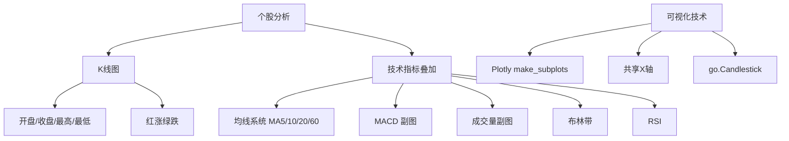

---

### 2.4 策略回测

> **对应代码**：`smilex/backtest.py`（`MAStrategy`、`run`）、`smilex/strategy.py`（`generate_signals`）、`dashboard/pages/04_策略回测.py`
>
> **难度**：进阶

#### 前置知识

- 交易策略基础概念（买入/卖出信号）
- Backtrader 框架的基本架构
- 绩效指标的含义（年化收益、最大回撤、胜率）

#### 核心概念

- **双均线交叉策略**：短期均线上穿长期均线买入，下穿卖出
- **金叉与死叉**：金叉=短期线上穿长期线（看涨），死叉=下穿（看跌）
- **A 股仓位管理**：以 100 股为单位买入（A 股最小交易单位为一手=100 股）
- **交易成本建模**：佣金 0.025%（`cerebro.broker.setcommission(commission=0.00025)`）
- **年化收益率**：`(1 + 总收益率) ^ (252 / 交易日数) - 1`
- **最大回撤**：资金曲线峰值到谷底的最大跌幅
- **胜率**：盈利交易次数 / 总交易次数
- **资金曲线**：每日账户总资产的时序变化

#### 学习主题

1. **Backtrader 架构**：Cerebro（引擎）、Strategy（策略）、Data Feeds（数据）、Broker（经纪商）
2. **信号生成**：纯 pandas 方式（`strategy.py` 的 `shift()` 判断交叉）vs Backtrader 方式（`CrossOver` 指标）
3. **仓位管理**：`self.broker.getcash()` 获取现金，按手数计算可买股数
4. **绩效指标计算**：总收益率、年化收益率、最大回撤、胜率的公式与代码实现
5. **资金曲线构建**：`_build_equity_curve()` 逐日计算账户价值
6. **回测局限性**：幸存者偏差、未来函数、过拟合、滑点未建模

#### 知识点详解

**Backtrader 核心架构（对应 Java 开发者思维）：**

| Backtrader 组件 | 职责 | Java 类比 |
|----------------|------|----------|
| Cerebro | 回测引擎，编排所有组件 | Spring ApplicationContext |
| Strategy | 交易逻辑，每根 K 线调用 `next()` | 业务 Service 类 |
| Data Feed | 输入数据（OHLCV） | 数据源/Repository |
| Broker | 资金管理、下单执行 | 交易网关接口 |
| Indicator | 技术指标计算 | 工具/Helper 类 |
| Observer | 监控资金曲线、交易记录 | AOP 切面/监听器 |

**两种信号生成方式对比：**

本项目同时实现了两种方式，值得对比学习：

```python
# 方式1：纯 pandas（strategy.py）
golden_cross = (df["ma5"] > df["ma20"]) & (df["ma5"].shift(1) <= df["ma20"].shift(1))
# 特点：简单直接，适合研究和验证

# 方式2：Backtrader 内置指标（backtest.py）
self.crossover = bt.indicators.CrossOver(self.ma_short, self.ma_long)
if self.crossover > 0:  # 金叉
# 特点：框架集成，自动处理边界情况
```

**绩效指标公式与含义：**

| 指标 | 公式 | 含义 | 好的标准 |
|------|------|------|---------|
| 总收益率 | (期末-期初)/期初 | 绝对盈亏 | > 0 |
| 年化收益率 | (1+总)^(252/天数)-1 | 标准化到年度 | > 15% |
| 最大回撤 | max((peak-valley)/peak) | 最坏情况亏多少 | < 20% |
| 胜率 | 盈利次数/总次数 | 每笔交易成功概率 | > 50% |
| 夏普比率 | (收益-无风险)/标准差 | 风险调整后收益 | > 1.0 |

**回测六大陷阱（新手必读）：**
1. **未来函数**：使用了当时不可能知道的数据（如当日收盘价做当日买入判断）
2. **幸存者偏差**：只回测至今还存在的股票，忽略已退市的
3. **过拟合**：参数过度优化历史数据，实盘表现差
4. **忽略滑点**：实盘成交价与预期价格有偏差
5. **忽略冲击成本**：大单交易会改变市场价格
6. **忽略资金限制**：全仓策略无法同时持有 50 只股票

#### 学习资料

**Backtrader 教程：**
- [Backtrader 官方快速入门](https://www.backtrader.com/docu/quickstart/quickstart/) — 逐步编写第一个策略
- [Backtrader 策略开发指南](https://www.backtrader.com/docu/strategy/) — Strategy 类完整参考
- [Backtrader 指标使用](https://www.backtrader.com/docu/induse/) — 122 个内置指标
- [知乎 — 手把手教你入门 Backtrader（系列）](https://zhuanlan.zhihu.com/p/140425363) — 以 20 日均线策略为例
- [CSDN — Backtrader 从入门到精通](https://blog.csdn.net/quant_galaxy/article/details/133125575) — 系统性教程
- [掘金 — Backtrader 入门系列](https://juejin.cn/post/6900356748134055944) — 逐步讲解技术细节

**视频课程：**
- [B站 — Backtrader 回测框架代码实战](https://www.bilibili.com/video/BV1QR4y147rS/) — 量化入门系列
- [B站 — Python 量化交易从入门到实战](https://www.bilibili.com/video/BV1nbtgzHEY2/) — 覆盖回测全流程

**回测避坑：**
- [最大回撤计算 3 个典型错误（CSDN）](https://blog.csdn.net/q3r4s5t/article/details/151137114) — 90% 新手会犯
- [夏普比率计算 3 个易犯错误（CSDN）](https://blog.csdn.net/weixin_30555125/article/details/159357770) — 时间尺度、无风险利率处理

**书籍推荐：**
- 《BackTrader 量化交易案例图解》— 从入门角度讲解，结合 A 股实盘数据
- 《Python 量化交易实战》— 从基础到回测，注重原理与实战结合

#### 实践练习

1. 阅读 `backtest.py` 的 `MAStrategy` 类（第 6-34 行），追踪一笔完整交易的 lifecycle
2. 对比 `strategy.py`（纯 pandas 信号）与 `backtest.py`（Backtrader 信号），理解两种实现方式
3. 在 `MAStrategy.next()` 中添加止损规则：亏损超过 5% 自动卖出
4. 实现新策略：RSI 均值回归（RSI < 30 买入，RSI > 70 卖出）
5. 在 `run()` 的返回值中新增夏普比率（Sharpe Ratio）计算
6. 对比不同均线参数组合（5/20 vs 10/30 vs 20/60）的回测结果

#### 知识图谱

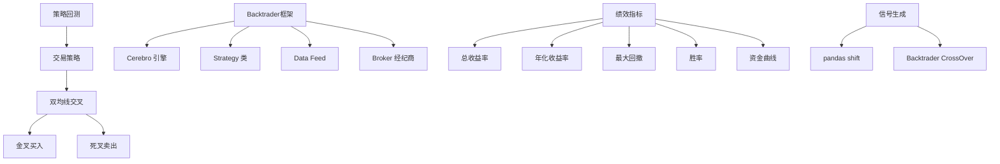

---

### 2.5 历史推荐

> **对应代码**：`dashboard/pages/05_历史推荐.py`、`smilex/scheduler.py`（`run_daily_job`、`get_scan_history`）、`smilex/notify.py`（`push_scan`、`_save_log`）
>
> **难度**：入门

#### 前置知识

- Python 文件 I/O 基础
- CSV 格式和 pandas 的读写操作
- JSON Lines（JSONL）格式

#### 核心概念

- **CSV 持久化**：每日扫描结果保存为 `data/history/scan_YYYYMMDD.csv`
- **JSONL 日志**：通知记录追加写入 `data/history/notifications.jsonl`
- **日期命名约定**：文件名包含日期便于排序和回查
- **历史回看**：加载指定日期的 CSV 文件展示当日推荐

#### 学习主题

1. **文件持久化模式**：CSV 存储表格数据，JSONL 存储事件流
2. **pandas CSV 操作**：`pd.read_csv()` 读取、`df.to_csv()` 写入
3. **JSONL 格式**：每行一个 JSON 对象，适合追加写入的事件日志
4. **数据版本管理**：按日期命名文件实现简单的版本控制

#### 知识点详解

**CSV vs JSONL 选型对比：**

| 特性 | CSV | JSONL |
|------|-----|-------|
| 适用场景 | 表格数据（行列表结构） | 事件流/日志（字段可能变化） |
| 读取方式 | `pd.read_csv()` → DataFrame | 逐行 `json.loads()` |
| 写入方式 | `df.to_csv()` | 逐行 `json.dumps() + "\n"` |
| 追加写入 | 需注意表头 | 天然支持追加 |
| 可读性 | 表格形式，直观 | 每行一个 JSON 对象 |
| 字段变化 | 不支持（需统一 schema） | 支持（每行独立） |

**本项目的持久化模式：**
```
扫描结果 → CSV（scan_YYYYMMDD.csv）→ 按日期归档，支持历史回看
通知记录 → JSONL（notifications.jsonl）→ 追加写入，记录每次推送
```

**日期命名约定最佳实践：**
- 格式：`scan_20250529.csv` — YYYYMMDD 保证文件名排序=时间排序
- 好处：`os.listdir().sort(reverse=True)` 即可获取最新文件
- 进阶：可改为 `scan_20250529_153000.csv` 包含精确时间

#### 学习资料

- [pandas to_csv 文档](https://pandas.pydata.org/docs/reference/api/pandas.DataFrame.to_csv.html) — CSV 写入参数详解
- [pandas read_csv 文档](https://pandas.pydata.org/docs/reference/api/pandas.read_csv.html) — CSV 读取参数详解
- Python 内置 [json 模块文档](https://docs.python.org/zh-cn/3/library/json.html) — JSONL 的基础

#### 实践练习

1. 追踪 `run_daily_job()` 的完整生命周期：扫描 → 保存 CSV → 推送通知
2. 阅读 `notify.py` 的 `_save_log()`，理解 JSONL 追加写入模式
3. 扩展功能：加载两个历史 CSV，找出连续两天都推荐的股票

#### 知识图谱

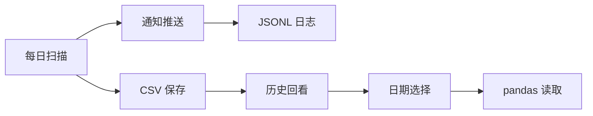

---

### 2.6 资讯查询

> **对应代码**：`smilex/consult/`（`em.py`、`ths.py`、`xq.py`、`news_em_flash.py`、`news_cls.py`、`news_cctv.py`、`news_stock.py`）、`smilex/news_sync.py`、`dashboard/pages/07_资讯查询.py`
>
> **难度**：中级

#### 前置知识

- HTTP 请求和 REST API 概念
- 数据去重的基本策略
- 异常处理（try/except）

#### 核心概念

- **多源数据聚合**：东方财富、财联社、央视新闻等多个数据源统一入库
- **数据去重**：通过 URL 的 UNIQUE 约束 + `INSERT OR IGNORE` 实现幂等写入
- **限频策略**：央视新闻每 6 小时抓取一次（`_should_fetch_cctv()`）
- **北向资金**：外资通过沪港通/深港通流入 A 股的资金，被视为"聪明钱"
- **龙虎榜**：每日涨跌幅/换手率异常的个股及买卖席位，揭示主力动向
- **融资融券**：借入资金买入（融资）或借入股票卖出（融券），反映杠杆交易情绪
- **雪球热度**：社交平台上的股票讨论热度排行，反映散户情绪

#### 学习主题

1. **多源数据架构**：每个数据源一个模块，统一输出 DataFrame 格式
2. **AKShare 数据接口**：`ak.stock_individual_fund_flow()`、`ak.stock_hsgt_north_net_flow_in_em()` 等
3. **直接 HTTP 请求**：部分数据源（如东方财富快讯）使用 `requests.get()` 直接抓取
4. **新闻去重策略**：URL 唯一性约束 + `INSERT OR IGNORE`
5. **增量同步模式**：`news_sync.py` 编排多源同步 + 自动清理过期数据
6. **关键市场概念**：北向资金流向、龙虎榜席位分析、融资融券余额

#### 知识点详解

**北向资金（"聪明钱"）：**
- 定义：通过沪股通+深股通从香港流入 A 股的外资
- 为什么重要：北向资金被视为"聪明钱"，其流向常领先于市场走势
- 数据获取：`ak.stock_hsgt_north_net_flow_in_em()`（本项目 `em.py` 已实现）
- 解读要点：
  - 连续多日净流入 → 外资看好 A 股，偏多信号
  - 单日大幅净流出 → 需警惕，但需结合市场环境
  - 关注重仓股变动：`ak.stock_hsgt_hold_detail_em()`

**龙虎榜（主力动向）：**
- 定义：交易所每日公布的异动股票榜单，披露买卖前五名营业部
- 上榜条件：日涨跌幅偏离值达 ±7%（主板）/ ±15%（创业板）、换手率达 20% 等
- 数据获取：`ak.stock_lhb_detail_em()`（本项目 `em.py` 已实现）
- 解读要点：
  - 机构专用席位买入 → 主力资金关注，中期看好
  - 游资营业部（如东方财富拉萨团结路）→ 短线投机为主
  - 买卖力度对比：买一金额 vs 卖一金额

**融资融券（杠杆情绪）：**
- 融资 = 借钱买股票（看多），融券 = 借股票卖出（看空）
- 融资余额上升 → 市场看多情绪增强
- 融券余额上升 → 市场看空情绪增强
- 维持担保比例低于 130% 有被强制平仓风险
- 数据获取：`ak.stock_margin_sse()`（本项目 `em.py` 已实现）

**多源数据架构设计模式：**
```
每个数据源独立模块（consult/*.py）
    ↓ 统一输出 DataFrame（columns: source, title, content, url, ...）
news_sync.py 编排多源同步
    ↓ 幂等写入（INSERT OR IGNORE on url）
SQLite news 表统一存储
    ↓ 按时间倒序查询
dashboard 展示
```

#### 学习资料

**市场数据概念入门：**
- [新手如何快速看懂股票基本面](https://ag.yueniuzq.com/stock/novice-first-lesson-how-to-quickly-read-stock-fundamentals/) — 快速阅读基本面指南
- [CSDN — A 股财务分析 12 个核心指标](https://blog.csdn.net/T20151470/article/details/159355480) — 从公式到 Python 代码
- [雪球 — PE/PB/ROE 三者关系](https://xueqiu.com/1912665285/114308475) — 核心公式 PB/PE = ROE

**AKShare 数据接口：**
- [AKShare 官方数据字典](https://akshare.akfamily.xyz/data/index.html) — 所有函数索引，导航到 A股查看
- [CSDN — 从零开始玩量化：AKShare 入门](https://blog.csdn.net/u010214511/article/details/124832321) — 完整入门教程
- [CSDN — AKShare 获取 A 股板块数据](https://blog.csdn.net/hzether/article/details/146106733) — 行业/概念/风格板块
- [知乎 — Python 和 AKShare 自动化收集股票数据](https://zhuanlan.zhihu.com/p/4875291787) — 自动化下载清洗实战

**数据源对比：**
- [知乎 — Python 常用金融数据接口库对比](https://zhuanlan.zhihu.com/p/1940820032784429315) — yfinance vs AKShare
- [CSDN — AKShare vs Tushare 对比](https://blog.csdn.net/zai_yuzhong/article/details/146549867) — 功能、费用、易用性对比

#### 实践练习

1. 对比 `news_em_flash.py`（直接 HTTP）和 `news_cls.py`（AKShare 封装），理解两种数据获取模式
2. 阅读 `news_sync.py` 的 `sync_all_news()`，理解多源编排和限频逻辑
3. 新增一个新闻源：创建 `news_sina.py`，参照现有模块实现新浪财经快讯
4. 阅读 `em.py` 的 `dragon_tiger()` 和 `north_flow()`，理解金融数据 API 的使用
5. 阅读 `news_sync.py` 的 `_should_fetch_cctv()`，理解基于时间戳的限频实现

#### 知识图谱

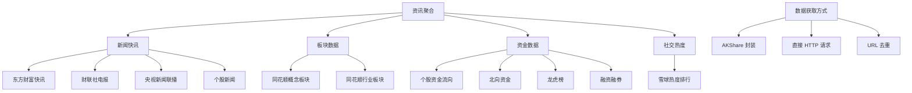

---

### 2.7 系统设置

> **对应代码**：`dashboard/pages/06_系统设置.py`、`smilex/scheduler.py`、`smilex/config.py`
>
> **难度**：中级

#### 前置知识

- 定时任务/调度概念（cron 表达式）
- Streamlit `session_state` 的生命周期
- JSON 配置文件读写

#### 核心概念

- **APScheduler**：Python 后台任务调度框架（Java 开发者可类比 Quartz Scheduler）
- **三种触发器**：cron（定时执行，如每日 15:30）、interval（间隔执行，如每 30 秒）
- **session_state**：Streamlit 跨 rerun 保持状态的机制，用于持有调度器实例
- **JSON 配置持久化**：`scheduler_config.json` 保存用户配置
- **三个独立任务**：每日选股（cron）、新闻同步（interval）、大盘同步（interval）

#### 学习主题

1. **APScheduler 架构**：`BackgroundScheduler`、Job、Trigger 三大组件
2. **Cron 表达式**：`hour=15, minute=30` 表示每个交易日 15:30 执行
3. **Interval 触发器**：`seconds=30` 每 30 秒执行一次
4. **Streamlit session_state**：`st.session_state["_scheduler"]` 跨 rerun 保持调度器实例
5. **配置管理模式**：`load_config()` / `save_config()` JSON 读写
6. **调度器生命周期**：start / stop / shutdown 的状态管理

#### 知识点详解

**APScheduler vs Quartz（Java）对照：**

| 特性 | APScheduler (Python) | Quartz (Java) |
|------|---------------------|---------------|
| 调度器类型 | BackgroundScheduler（线程）| Scheduler（线程池）|
| Cron 触发器 | `hour=15, minute=30` | `"0 30 15 * * ?"` |
| Interval 触发器 | `seconds=30` | `simpleSchedule().withIntervalInSeconds(30)` |
| 持久化 | 可选（默认内存） | 支持 JDBC JobStore |
| 集群 | 不支持 | 支持 |
| 适用场景 | 单机脚本/轻量服务 | 企业级应用 |

**Streamlit session_state 原理：**
- Streamlit 每次用户交互都会重新执行整个脚本（rerun）
- `st.session_state` 是跨 rerun 持久化的字典，类似于 HTTP Session
- 本项目用 `st.session_state["_scheduler"]` 持有 APScheduler 实例
- **关键**：如果不在 session_state 中保存，调度器实例会在 rerun 时丢失
- Java 类比：类似 `@SessionScope` Bean

**本项目的三个调度任务设计：**
```
每日选股（cron）        → 每天 15:30 执行一次 → 收盘后扫描全市场
新闻同步（interval）    → 每 30 秒执行一次   → 实时获取最新快讯
大盘同步（interval）    → 每 60 秒执行一次   → 实时更新指数和涨跌统计
```

**调度器生命周期管理：**
```
start_scheduler() → 创建 BackgroundScheduler → 注册 jobs → start()
stop_scheduler()  → shutdown(wait=False) → 清理 session_state
restart           → 先 stop 再 start（先关闭旧实例再创建新的）
```

#### 学习资料

**APScheduler：**
- [APScheduler 官方文档（3.x）](https://apscheduler.readthedocs.io/en/3.x/) — 完整 API 参考
- [APScheduler 用户指南](https://apscheduler.readthedocs.io/en/3.x/userguide.html) — 四大组件详解
- [CronTrigger API](https://apscheduler.readthedocs.io/en/3.x/modules/triggers/cron.html) — Cron 触发器参数
- [IntervalTrigger API](https://apscheduler.readthedocs.io/en/3.x/modules/triggers/interval.html) — Interval 触发器参数
- [Better Stack — APScheduler 实用指南](https://betterstack.com/community/guides/scaling-python/apscheduler-scheduled-tasks/) — 安装到实战

**Streamlit session_state：**
- [st.session_state 官方文档](https://docs.streamlit.io/develop/api-reference/caching-and-state/st.session_state) — 状态持久化机制
- [Streamlit 多页应用指南](https://docs.streamlit.io/develop/concepts/multipage-apps/overview) — 多页应用架构

#### 实践练习

1. 阅读 `06_系统设置.py`，理解 UI 操作如何映射到 `start_scheduler()` / `stop_scheduler()`
2. 追踪 `start_scheduler()` 中三个独立任务的注册逻辑
3. 修改配置支持每日多次扫描（如增加午盘和尾盘扫描）
4. 为单个同步任务添加"暂停/恢复"功能
5. 对比 APScheduler 与 Java Quartz 的异同（API 设计、触发器类型、持久化方式）

#### 知识图谱

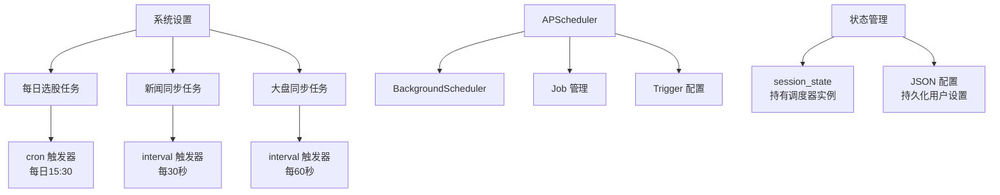

---

### 2.8 数据采集层

> **对应代码**：`smilex/fetcher.py`
>
> **难度**：入门
>
> **Java 对照**：AKShare ~ 各类 Java HTTP 客户端封装的金融 API（如 Tushare SDK）

#### 前置知识

- API 调用的基本概念
- pandas DataFrame 基础操作
- 列名重命名和数据清洗

#### 核心概念

- **AKShare**：Python 金融数据开源库，统一封装了东方财富、同花顺、新浪等多个数据源
- **前复权（qfq）**：以最新价格为基准向前调整历史价格，消除除权除息造成的跳空
- **列名映射**：AKShare 返回中文列名，需 `rename()` 映射为英文标准名
- **数据源函数**：`stock_zh_a_spot_em()`（实时行情）、`stock_zh_a_hist()`（历史 K 线）、`stock_zh_index_daily()`（指数）

#### 学习主题

1. **AKShare 安装与配置**：`pip install akshare` 或 `uv add akshare`
2. **核心函数**：`stock_list()` 封装 `ak.stock_zh_a_spot_em()`；`daily_history()` 封装 `ak.stock_zh_a_hist()`
3. **数据清洗模式**：中文列名 → 英文列名映射、过滤 ST 股、重置索引
4. **复权处理**：前复权（qfq）vs 后复权（hfq）vs 不复权的区别和选择
5. **API 限流与容错**：调用频率控制、try/except 异常处理
6. **与其他库对比**：AKShare vs Tushare vs BaoStock 的功能差异

#### 知识点详解

**A股数据接口库对比：**

| 特性 | AKShare（本项目使用） | Tushare | BaoStock |
|------|-----|---------|---------|
| 费用 | 完全免费开源 | 免费但部分接口需积分 | 免费开源 |
| 注册 | 无需注册 | 需注册获取 Token | 无需注册 |
| 数据范围 | 全球多市场 | A 股为主 | A 股为主 |
| 更新频率 | 频繁更新 | 相对稳定 | 较少更新 |
| 数据质量 | 高（来源东方财富等） | 高 | 一般 |
| 推荐场景 | 学习研究首选 | 需要稳定接口时 | 历史数据补充 |

**复权处理详解（以分红为例）：**
- 假设某股 100 元，每 10 股派 10 元（即每股 1 元）
- 除权日开盘价 = 100 - 1 = 99 元 → 不复权 K 线出现"跳空缺口"
- 前复权：调整历史价格 → 99 元之前的价格都减 1 → K 线连续，适合技术分析
- 后复权：调整后续价格 → 反映真实总收益（含分红），适合计算总回报

**本项目数据清洗模式（fetcher.py 典型流程）：**
```python
df = ak.stock_zh_a_spot_em()              # 1. 获取原始数据（中文列名）
df = df[~df["名称"].str.contains("ST|退")] # 2. 过滤不需要的数据
df = df.rename(columns={"代码":"code",...})# 3. 列名映射（中→英）
df = df[["code","name",...]]               # 4. 选择需要的列
df = df.reset_index(drop=True)             # 5. 重置索引
```

**AKShare 核心 API 速查：**
| 函数 | 用途 | 本项目封装 |
|------|------|-----------|
| `ak.stock_zh_a_spot_em()` | 全市场实时行情 | `stock_list()`, `realtime_quote()` |
| `ak.stock_zh_a_hist()` | 个股历史 K 线 | `daily_history()` |
| `ak.stock_zh_index_daily()` | 指数日 K 线 | `index_daily()` |
| `ak.stock_board_industry_name_em()` | 行业板块列表 | `sector_list()` |
| `ak.stock_individual_info_em()` | 个股基本信息 | `stock_info()` |

#### 学习资料

**AKShare 入门：**
- [AKShare 官方文档](https://akshare.akfamily.xyz/) — 入口页面，含安装和教程
- [AKShare 快速入门](https://akshare.akfamily.xyz/tutorial.html) — 官方教程
- [AKShare 数据字典](https://akshare.akfamily.xyz/data/index.html) — 所有 API 函数索引
- [AKShare GitHub 仓库](https://github.com/akfamily/akshare) — 源码和更新日志
- [AKTools 在线 API 浏览器](https://aktools.akfamily.xyz/) — 交互式测试 API

**中文教程：**
- [CSDN — 从零开始玩量化：AKShare 入门](https://blog.csdn.net/u010214511/article/details/124832321) — 适合初学者的完整教程
- [知乎 — Python 和 AKShare 自动化收集股票数据](https://zhuanlan.zhihu.com/p/4875291787) — 自动化下载清洗
- [CSDN — AKShare vs Tushare 对比](https://blog.csdn.net/zai_yuzhong/article/details/146549867) — 选型参考

#### 实践练习

1. 阅读 `fetcher.py` 每个函数，找出它封装的 AKShare 原始函数
2. 新增一个函数 `weekly_history()`，获取周 K 线数据（提示：`period="weekly"`）
3. 为 `daily_history()` 添加重试逻辑（指数退避，最多重试 3 次）
4. 添加数据缓存：对频繁请求的股票列表做内存缓存，减少 API 调用

#### 知识图谱

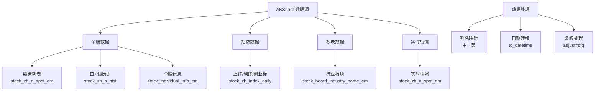

---

### 2.9 技术指标层

> **对应代码**：`smilex/indicators.py`
>
> **难度**：中级
>
> **Java 对照**：pandas rolling ~ Java Stream 的滑动窗口；pandas-ta ~ TA4J（Java 技术分析库）

#### 前置知识

- 基础统计学（均值、标准差）
- 时间序列分析概念
- pandas rolling/ewm 操作

#### 核心概念

本项目实现了 6 种经典技术指标：

| 指标 | 类型 | 计算方式 | 金融含义 |
|------|------|---------|---------|
| MA（移动平均线） | 趋势 | `close.rolling(N).mean()` | N 日平均价格，平滑短期波动 |
| MACD | 趋势/动量 | pandas-ta `ta.macd()` | 快慢均线差值，判断趋势方向和强度 |
| RSI（相对强弱） | 动量 | pandas-ta `ta.rsi()` | 0-100 区间，>70 超买，<30 超卖 |
| 布林带 | 波动率 | pandas-ta `ta.bbands()` | 中轨±2倍标准差，衡量价格波动范围 |
| KDJ（随机指标） | 动量 | 手动计算（RSV→K→D→J） | 衡量收盘价在近期价格区间中的位置 |
| 量比 | 成交量 | `volume / volume.rolling(5).mean().shift(1)` | 当前成交量与 5 日均量的比值 |

#### 学习主题

1. **移动平均线（MA）**：`close.rolling(window=N).mean()` 的数学公式和趋势判断
2. **MACD 构建**：DIF = EMA(12) - EMA(26)，DEA = EMA(DIF, 9)，MACD 柱 = 2(DIF - DEA)
3. **RSI 计算**：基于 N 日内涨跌幅的比率，判断超买超卖
4. **布林带构建**：中轨 = MA(20)，上/下轨 = 中轨 ± 2×标准差
5. **KDJ 手动计算**：RSV → K（EMA 平滑）→ D（再平滑）→ J = 3K - 2D
6. **量比计算**：当前量 / 前 5 日均量（注意 `shift(1)` 避免引入未来数据）
7. **pandas-ta vs 手动计算**：`macd()` 用 pandas-ta、`kdj()` 手动实现，对比两种方式

#### 知识点详解

**6 种技术指标数学公式与代码对照：**

**1. MA（移动平均线）— 趋势指标**
```
公式：MA(N) = Σ(close[i]) / N   (i = 0..N-1)
代码：df["close"].rolling(window=N).mean()
用途：平滑价格波动，判断趋势方向
```

**2. MACD（指数平滑异同移动平均线）— 趋势/动量指标**
```
公式：
  DIF = EMA(close, 12) - EMA(close, 26)    ← 快线-慢线
  DEA = EMA(DIF, 9)                         ← DIF 的移动平均
  MACD柱 = 2 × (DIF - DEA)                  ← 柱状图

代码：ta.macd(df["close"], fast=12, slow=26, length=9)
信号：DIF 上穿 DEA = 金叉（买），DIF 下穿 DEA = 死叉（卖）
```

**3. RSI（相对强弱指标）— 动量指标**
```
公式：
  涨幅平均 = avg(涨的日子, 14天)
  跌幅平均 = avg(跌的日子, 14天)
  RSI = 涨幅平均 / (涨幅平均 + 跌幅平均) × 100

代码：ta.rsi(df["close"], length=14)
区间：> 70 超买（可能回调），< 30 超卖（可能反弹）
```

**4. 布林带（Bollinger Bands）— 波动率指标**
```
公式：
  中轨 = MA(close, 20)
  上轨 = 中轨 + 2 × StdDev(close, 20)
  下轨 = 中轨 - 2 × StdDev(close, 20)

代码：ta.bbands(df["close"], length=20, std=2)
信号：价格触及上轨→超买；触及下轨→超卖；收窄→即将突破
```

**5. KDJ（随机指标）— 动量指标**
```
公式：
  RSV = (close - LowMin9) / (HighMax9 - LowMin9) × 100
  K = RSV × 1/3 + 前K × 2/3       ← ewm(com=2)
  D = K × 1/3 + 前D × 2/3         ← ewm(com=2)
  J = 3K - 2D                      ← 灵敏线

代码（手动实现，见 indicators.py:38-45）：
  rsv = (close - low.rolling(9).min()) / (high.rolling(9).max() - low.rolling(9).min()) * 100
  kdj_k = rsv.ewm(com=2, adjust=False).mean()
  kdj_d = kdj_k.ewm(com=2, adjust=False).mean()
  kdj_j = 3 * kdj_k - 2 * kdj_d
信号：K 上穿 D = 金叉（买）；J > 100 超买；J < 0 超卖
```

**6. 量比 — 成交量指标**
```
公式：量比 = 当日成交量 / 过去5日平均成交量
代码：df["volume"] / df["volume"].rolling(5).mean().shift(1)
注意：shift(1) 确保不使用当日数据计算均值（避免未来函数）
解读：> 2.5 明显放量；1.5-2.5 温和放量；< 0.75 缩量
```

**pandas 三个核心操作速查：**
```python
# rolling — 滑动窗口（计算移动平均）
df["close"].rolling(window=20).mean()        # MA20
df["close"].rolling(window=20).std()         # 20日标准差

# ewm — 指数加权移动平均（近期数据权重更大）
df["close"].ewm(span=12, adjust=False).mean() # EMA12
df["rsv"].ewm(com=2, adjust=False).mean()     # K值

# shift — 平移数据（用于比较前后日）
df["close"].shift(1)         # 昨日收盘价
(df["ma5"] > df["ma20"]) & (df["ma5"].shift(1) <= df["ma20"].shift(1))  # 金叉
```

#### 学习资料

**技术指标教程：**
- [B站 — 技术分析新手入门系列](https://www.bilibili.com/video/BV1xf4y1t7YB/) — 每个指标 10 分钟讲透
- [BigQuant 量化策略指标解析](https://bigquant.com/wiki/doc/C54hzJxRqd) — 含代码的指标策略应用
- [博客园 — MACD/RSI/KDJ/BOLL 详解](https://www.cnblogs.com/lsgxeva/p/19063828) — 公式与使用场景
- [Titan FX — 布林带实战策略](https://research.titanfx.com/cn/technical-analysis/bollinger-bands/bollinger-bands-strategies) — 6 大交易策略

**pandas 核心操作：**
- [pandas rolling API](https://pandas.pydata.org/docs/reference/api/pandas.DataFrame.rolling.html) — 滑动窗口
- [pandas ewm API](https://pandas.pydata.org/docs/reference/api/pandas.DataFrame.ewm.html) — 指数加权
- [pandas shift API](https://pandas.pydata.org/docs/reference/api/pandas.DataFrame.shift.html) — 数据平移
- [pandas 窗口函数用户指南](https://pandas.pydata.org/docs/user_guide/window.html) — rolling/ewm 综合指南

**pandas-ta 库：**
- [pandas-ta GitHub（推荐分支）](https://github.com/xgboosted/pandas-ta-classic) — 192 个指标，活跃维护
- [pandas-ta ReadTheDocs](https://technical-analysis-library-in-python.readthedocs.io/) — API 文档

**书籍推荐：**
- 《布林线（珍藏版）》— John Bollinger — 布林带创始人的经典著作
- 《利用 Python 进行数据分析》（第3版）— Wes McKinney — pandas 创始人写的经典

#### 实践练习

1. 对 `indicators.py` 每个函数，先在纸上写出数学公式，再对照代码验证
2. 对比 `macd()`（pandas-ta 实现）和 `kdj()`（手动实现），理解两种计算方式
3. 新增指标 ATR（真实波动幅度）：用 pandas-ta 的 `ta.atr()` 实现
4. 修改布林带参数为 `(20, 2.5)`，观察对选股结果的影响
5. 为 `ma()` 函数编写单元测试，验证计算结果的正确性

#### 知识图谱

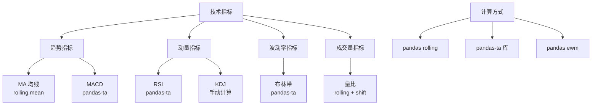

---

### 2.10 数据存储层

> **对应代码**：`smilex/store.py`
>
> **难度**：入门
>
> **Java 对照**：SQLite + pandas ~ Spring Data JPA + H2 数据库；`to_sql()` ~ JPA `saveAll()`；`read_sql()` ~ JPA `findAll()`

#### 前置知识

- SQL 基础（CREATE TABLE、INSERT、SELECT、WHERE、ORDER BY）
- SQLite 特性（单文件数据库、无需服务端）
- pandas SQL 集成

#### 核心概念

项目使用 5 张表存储数据：

| 表名 | 主键 | 用途 |
|------|------|------|
| `stock_info` | code | 股票基本信息（代码、名称） |
| `stock_daily` | (code, date) | 日 K 线行情数据 |
| `index_daily` | (code, date) | 指数日 K 线数据 |
| `news` | id (自增), url (UNIQUE) | 新闻资讯 |
| `market_stats` | id (自增) | 市场统计快照 |

关键设计模式：
- **临时表中转**：`save_daily()` 先写 `_tmp_daily` 临时表，再 `INSERT OR REPLACE` 合并到主表
- **幂等写入**：`INSERT OR REPLACE`（日K数据可覆盖更新）、`INSERT OR IGNORE`（新闻按 URL 去重）
- **复合主键**：`(code, date)` 确保每只股票每天只有一条记录
- **索引优化**：`idx_news_source`、`idx_news_publish` 加速新闻查询

#### 学习主题

1. **SQLite vs MySQL/PostgreSQL**：轻量级、零配置、单文件，适合本地应用和原型开发
2. **Schema 设计**：复合主键选择、字段类型、索引策略
3. **pandas SQL 操作**：`df.to_sql()` 写入、`pd.read_sql()` 读取
4. **Upsert 模式**：SQLite 的 `INSERT OR REPLACE` 和 `INSERT OR IGNORE`
5. **临时表中转模式**：避免逐行 INSERT，利用 pandas 批量写入 + SQL 合并
6. **数据清理**：`cleanup_old_news()` 定期清理过期数据

#### 知识点详解

**SQLite vs 传统关系型数据库：**

| 特性 | SQLite | MySQL/PostgreSQL |
|------|--------|-----------------|
| 部署 | 单文件，零配置 | 需要安装服务端 |
| 性能 | 小数据量极快 | 大数据量/并发更优 |
| 适用场景 | 本地应用、原型、嵌入式 | Web 服务、多用户 |
| 本项目选择理由 | 量化工具单机使用，无需服务端 | — |

**本项目 Schema 设计决策：**
```
stock_daily 表主键 = (code, date)
  → 为什么不用自增 id？因为需要按股票+日期去重，复合主键天然去重
  → 为什么用 INSERT OR REPLACE？同一股票同一天数据可能需要更新（如复权调整）

news 表主键 = id（自增），url = UNIQUE
  → 为什么 url 要 UNIQUE？新闻去重：同一 URL 只入库一次
  → 为什么用 INSERT OR IGNORE？重复新闻静默跳过，不报错
```

**临时表中转模式详解（本项目 `save_daily()` 的核心模式）：**
```python
# Step 1: pandas 批量写入临时表（快）
df.to_sql("_tmp_daily", conn, if_exists="replace", index=False)
# Step 2: SQL 合并到主表（幂等）
conn.execute("INSERT OR REPLACE INTO stock_daily SELECT * FROM _tmp_daily")
# Step 3: 清理临时表
conn.execute("DROP TABLE _tmp_daily")
```
- 为什么不直接 `to_sql("stock_daily")`？因为 `to_sql(if_exists="replace")` 会**删除整个表再重建**，丢失已有数据
- 临时表模式 = 批量写入 + SQL 合并，兼顾性能和数据安全

**pandas SQL 操作核心 API：**
```python
# 写入
df.to_sql("table_name", conn, if_exists="replace", index=False)
# if_exists: "fail"(默认，已存在报错) / "replace"(删除重建) / "append"(追加)

# 读取
df = pd.read_sql("SELECT * FROM table WHERE code = ?", conn, params=[code])

# Java 开发者类比：
# to_sql() ~ JPA saveAll()
# read_sql() ~ JPA findAll() + @Query
```

#### 学习资料

**SQLite：**
- [SQLite 官方文档](https://www.sqlite.org/docs.html) — 完整参考
- [菜鸟教程 — SQLite](https://www.runoob.com/sqlite/sqlite-tutorial.html) — 中文入门教程

**pandas SQL 集成：**
- [pandas to_sql API](https://pandas.pydata.org/docs/reference/api/pandas.DataFrame.to_sql.html) — 写入参数详解
- [pandas read_sql API](https://pandas.pydata.org/docs/reference/api/pandas.read_sql.html) — 读取参数详解
- [Medium — Pandas 与 SQL 集成最佳实践](https://medium.com/@helvila/integrating-pandas-with-sql-best-practices-and-advanced-techniques-for-large-datasets-1a7b4cfa754e) — 大数据集技巧

#### 实践练习

1. 阅读 `init_db()`（第 12-49 行），理解 5 张表 + 2 个索引的完整 schema
2. 追踪 `save_daily()` 的临时表中转模式：`to_sql("_tmp")` → `INSERT OR REPLACE` → `DROP TABLE`
3. 新增一张表 `backtest_results`，用于存储回测结果
4. 编写查询：找出过去一周平均量比最高的 10 只股票
5. 对比此 SQLite 方案与 Spring Boot + JPA 的设计差异（ORM vs 原生 SQL）

#### 知识图谱

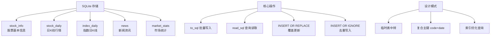

---

## 第三章：12 周学习计划

### 第一阶段：基础（第 1-4 周）

| 周 | 学习内容 | 对应模块 | 里程碑 |
|----|---------|---------|--------|
| 1 | Python 语法差异（vs Java）、pandas 基础 | `config.py`、`store.py` | 能读懂 SQLite 表结构和配置 |
| 2 | AKShare 数据获取、K 线数据结构 | `fetcher.py` | 能获取指定股票的历史数据 |
| 3 | 技术指标数学原理 + 代码实现 | `indicators.py` | 能解释每个指标的公式和含义 |
| 4 | Streamlit + Plotly 入门 | `01_大盘概览.py` | 能运行看板并看懂大盘页面代码 |

### 第二阶段：核心（第 5-8 周）

| 周 | 学习内容 | 对应模块 | 里程碑 |
|----|---------|---------|--------|
| 5 | 多因子选股逻辑 + 评分系统 | `scanner.py`、`02_今日推荐.py` | 能修改评分规则并运行扫描 |
| 6 | K 线可视化 + 指标叠加 | `03_个股分析.py` | 能添加新的指标子图 |
| 7 | Backtrader 回测框架 | `backtest.py`、`strategy.py` | 能实现一个新策略并回测 |
| 8 | 多源数据聚合 + 新闻同步 | `consult/`、`news_sync.py` | 能新增一个数据源模块 |

### 第三阶段：进阶（第 9-12 周）

| 周 | 学习内容 | 对应模块 | 里程碑 |
|----|---------|---------|--------|
| 9 | 任务调度 + 配置管理 | `scheduler.py`、`06_系统设置.py` | 能自定义定时任务 |
| 10 | 代码质量：测试、错误处理、日志 | `tests/` | 为核心模块编写单元测试 |
| 11 | 功能扩展：新指标、新策略 | `indicators.py`、`backtest.py` | 实现 ATR 指标 + RSI 策略 |
| 12 | 架构优化：异步数据获取、缓存层 | 全局 | 优化 API 调用性能 |

---

## 第四章：参考资源

### Python 基础

**书籍：**
- 《利用 Python 进行数据分析》（第3版）— Wes McKinney — pandas 创始人的经典著作
- 《对比 Excel，轻松学习 Python 数据分析》— 张俊红 — 以 Excel 对比方式讲解 pandas，入门友好

**官方文档：**
- [Python 官方教程（中文）](https://docs.python.org/zh-cn/3/tutorial/)
- [pandas 官方文档](https://pandas.pydata.org/docs/)
- [pandas GroupBy 指南](https://pandas.pydata.org/docs/user_guide/groupby.html) — 聚合/筛选/转换
- [pandas 窗口函数指南](https://pandas.pydata.org/docs/user_guide/window.html) — rolling/ewm

**在线教程：**
- [菜鸟教程 — Pandas 股票数据分析](https://www.runoob.com/pandas/pandas-stock.html)
- [图解 Pandas — 股票数据分析](https://pandas.liuzaoqi.com/doc/chapter6/%E8%82%A1%E7%A5%A8%E6%95%B0%E6%8D%AE%E5%88%86%E6%9E%90.html) — 真实股票数据操作

### 金融数据

**官方文档：**
- [AKShare 官方文档](https://akshare.akfamily.xyz/) — 入口页面
- [AKShare 数据字典](https://akshare.akfamily.xyz/data/index.html) — 所有 API 函数索引
- [AKShare 快速入门](https://akshare.akfamily.xyz/tutorial.html) — 官方教程
- [BaoStock 文档](http://baostock.com/)

**中文教程：**
- [CSDN — 从零开始玩量化：AKShare 入门](https://blog.csdn.net/u010214511/article/details/124832321)
- [知乎 — Python 和 AKShare 自动化收集股票数据](https://zhuanlan.zhihu.com/p/4875291787)
- [知乎 — Python 常用金融数据接口库对比](https://zhuanlan.zhihu.com/p/1940820032784429315) — yfinance vs AKShare
- [CSDN — AKShare vs Tushare 对比分析](https://blog.csdn.net/zai_yuzhong/article/details/146549867)

### 技术分析

**经典书籍：**
- 《日本蜡烛图技术》— Steve Nison — K 线分析必读经典
- 《股市趋势技术分析》（第10版）— Edwards & Magee — 技术分析"圣经"
- 《布林线（珍藏版）》— John Bollinger — 布林带创始人著作
- 《技术分析（第五版）》— Martin J. Pring

**在线教程：**
- [B站 — 技术分析新手入门系列](https://www.bilibili.com/video/BV1xf4y1t7YB/) — 每个指标 10 分钟
- [BigQuant 量化策略指标解析](https://bigquant.com/wiki/doc/C54hzJxRqd) — 含代码的指标策略应用
- [博客园 — MACD/RSI/KDJ/BOLL 详解](https://www.cnblogs.com/lsgxeva/p/19063828) — 公式与场景
- [Titan FX — 布林带实战策略](https://research.titanfx.com/cn/technical-analysis/bollinger-bands/bollinger-bands-strategies)

### 量化交易

**入门书籍：**
- 《量化投资：以 Python 为工具》— 蔡立耑 — 金融科技丛书，适合入门
- 《基于 Python 的金融分析与风险管理》— 斯文 — 244 个实操示例
- 《打开量化投资的黑箱》— Rishi K. Narang — 系统剖析量化投资全流程

**进阶书籍：**
- 《Quantitative Trading》— Ernest P. Chan — 从零搭建算法交易系统
- 《Algorithmic Trading》— Ernest P. Chan — 算法交易策略深入
- 《Python 金融大数据分析》（第2版）— Yves Hilpisch — 全面覆盖金融分析

**书单索引：**
- [GitHub — 量化投资经典书单](https://github.com/jincheng9/finance_tutorial/blob/main/workspace/book/00-quant-book.md)
- [知乎 — 10 本必备书籍推荐](https://zhuanlan.zhihu.com/p/460391143)
- [2026 量化交易必读书单](https://waylandz.com/quant-book/)
- [Quant Wiki — 量化百科](https://quant-wiki.com/library/book/beginner/)

**在线教程：**
- [知乎 — 量化文章合辑（入门到实战）](https://zhuanlan.zhihu.com/p/1991610362093655453)
- [B站 — Python 量化交易从入门到实战](https://www.bilibili.com/video/BV1nbtgzHEY2/)
- [B站 — Python 量化交易零基础（426 集）](https://www.bilibili.com/video/BV1z5kfBKE4Z/)
- [腾讯云 — 量化交易资源整理](https://cloud.tencent.com/developer/article/2104786)

### 回测框架

**Backtrader 官方文档：**
- [Backtrader 官方文档](https://www.backtrader.com/docu/)
- [快速入门](https://www.backtrader.com/docu/quickstart/quickstart/)
- [策略开发指南](https://www.backtrader.com/docu/strategy/)
- [指标使用指南](https://www.backtrader.com/docu/induse/) — 122 个内置指标

**中文教程：**
- [知乎 — 手把手教你入门 Backtrader（系列）](https://zhuanlan.zhihu.com/p/140425363)
- [CSDN — Backtrader 从入门到精通](https://blog.csdn.net/quant_galaxy/article/details/133125575)
- [掘金 — Backtrader 入门系列](https://juejin.cn/post/6900356748134055944)
- [B站 — Backtrader 回测框架代码实战](https://www.bilibili.com/video/BV1QR4y147rS/)
- [腾讯云 — BackTrader 中文文档](https://cloud.tencent.com/developer/article/2420533)

**避坑指南：**
- [最大回撤计算 3 个典型错误（CSDN）](https://blog.csdn.net/q3r4s5t/article/details/151137114)
- [夏普比率计算易犯错误（CSDN）](https://blog.csdn.net/weixin_30555125/article/details/159357770)

### 可视化

**官方文档：**
- [Streamlit 官方文档](https://docs.streamlit.io/)
- [Streamlit API 参考](https://docs.streamlit.io/develop/api-reference)
- [st.metric 文档](https://docs.streamlit.io/develop/api-reference/data/st.metric)
- [st.columns 文档](https://docs.streamlit.io/develop/api-reference/layout/st.columns)
- [st.session_state 文档](https://docs.streamlit.io/develop/api-reference/caching-and-state/st.session_state)
- [多页应用指南](https://docs.streamlit.io/develop/concepts/multipage-apps/overview)
- [Plotly Python 文档](https://plotly.com/python/)
- [Plotly Candlestick 参考](https://plotly.com/python/reference/candlestick/)
- [Plotly 子图指南](https://plotly.com/python/subplots/)
- [Plotly 散点图教程](https://plotly.com/python/line-and-scatter/)

**中文教程：**
- [知乎 — Streamlit 教程：构建可视化 Web](https://zhuanlan.zhihu.com/p/448912854)
- [腾讯云 — Streamlit 数据可视化面板教程](https://cloud.tencent.com/developer/article/1849025)
- [博客园 — Plotly 与 Streamlit 结合实战](https://www.cnblogs.com/wang_yb/p/18870563)
- [GitHub — Streamlit 中文文档翻译](https://github.com/Panda-NEUer/Streamlit-Documentation-Chinese)

**视频课程：**
- [B站 — Streamlit 可视化看板教程](https://www.bilibili.com/video/BV1YM4y1A7jt/)
- [B站 — Streamlit + Plotly 数据看板](https://www.bilibili.com/video/BV1Ks4y1g7m3/)

### 任务调度

- [APScheduler 官方文档（3.x）](https://apscheduler.readthedocs.io/en/3.x/)
- [APScheduler 用户指南](https://apscheduler.readthedocs.io/en/3.x/userguide.html)
- [CronTrigger API](https://apscheduler.readthedocs.io/en/3.x/modules/triggers/cron.html)
- [IntervalTrigger API](https://apscheduler.readthedocs.io/en/3.x/modules/triggers/interval.html)
- [Better Stack — APScheduler 实用指南](https://betterstack.com/community/guides/scaling-python/apscheduler-scheduled-tasks/)

### 开源项目参考

- [Whale-Quant（Datawhale）](https://github.com/datawhalechina/whale-quant) — 量化开源课程
- [Stock Backtrader Web App](https://github.com/chenwr727/stock-backtrader-web-app) — Streamlit + Backtrader 完整项目
- [pythondict-quant](https://github.com/Ckend/pythondict-quant) — 量化投资实战教程含代码

### A 股投资入门

- [上交所投资者教育 — 股市新手村](https://edu.sse.com.cn/) — 交易所官方教程
- [平安证券投资者教育基地](https://edu.stock.pingan.com/) — 免费视频教程全覆盖
- [知乎 — 2026 股市分析完整知识框架](https://zhuanlan.zhihu.com/p/1999423823896913760)

### pandas-ta 技术分析库

- [pandas-ta GitHub（推荐活跃分支）](https://github.com/xgboosted/pandas-ta-classic) — 192 个指标，62 个 K 线形态
- [pandas-ta ReadTheDocs 文档](https://technical-analysis-library-in-python.readthedocs.io/) — API 文档
