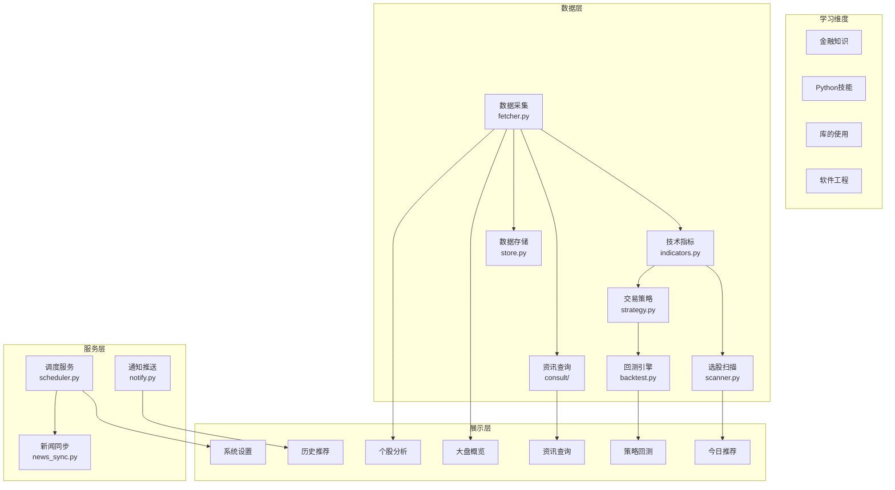

# 全局知识图谱

> 建议在开始 12 周学习前先阅读本文，建立整体认知。

## Java → Python 对照速查

| Java 概念 | Python / 本项目对应 |
|-----------|-------------------|
| Spring Boot + Thymeleaf | Streamlit（无需前后端分离，Python 直接写 UI）|
| Spring Data JPA + H2/MySQL | SQLite + pandas `to_sql()`/`read_sql()` |
| Quartz Scheduler | APScheduler `BackgroundScheduler` |
| OkHttp / Retrofit | AKShare（封装好的金融数据 API）|
| Jackson / Gson | pandas DataFrame（结构化数据处理）|
| JUnit | pytest |
| Maven / Gradle | uv（Python 包管理器）|
| Stream + Record 列表操作 | pandas DataFrame 操作 |

## 系统架构知识图谱



## 学习路线依赖图

```mermaid
graph LR
    subgraph 第一阶段：基础
        W1["W1 Python+pandas"] --> W2["W2 数据获取"]
        W2 --> W3["W3 技术指标"]
        W3 --> W4["W4 Streamlit"]
    end
    subgraph 第二阶段：核心
        W4 --> W5["W5 选股扫描"]
        W4 --> W6["W6 个股分析"]
        W5 --> W7["W7 策略回测"]
        W2 --> W8["W8 资讯聚合"]
    end
    subgraph 第三阶段：进阶
        W5 --> W9["W9 任务调度"]
        W7 --> W10["W10 测试"]
        W3 --> W11["W11 功能扩展"]
        W9 --> W12["W12 架构优化"]
    end
```

## 四大学习维度

| 维度 | 涵盖内容 | 本周分布 |
|------|---------|---------|
| **金融知识** | A股制度、技术指标、市场概念 | W1-3, W5, W8 |
| **Python 技能** | 语法、pandas、数据处理 | W1, W3, W10 |
| **库的使用** | AKShare、Backtrader、Streamlit、Plotly | W2, W4, W7 |
| **软件工程** | 数据库设计、调度、测试、架构 | W1, W9-12 |

## 技术栈全景

```
┌─────────────────────────────────────────────────┐
│  可视化层    Streamlit + Plotly                   │
├─────────────────────────────────────────────────┤
│  服务层      APScheduler + notify                 │
├─────────────────────────────────────────────────┤
│  策略层      strategy.py + backtest.py(Backtrader)│
├─────────────────────────────────────────────────┤
│  分析层      indicators.py + scanner.py(pandas-ta)│
├─────────────────────────────────────────────────┤
│  数据层      fetcher.py(AKShare) + store.py(SQLite)│
├─────────────────────────────────────────────────┤
│  基础设施    Python 3.12+ / uv / pandas / numpy   │
└─────────────────────────────────────────────────┘
```
