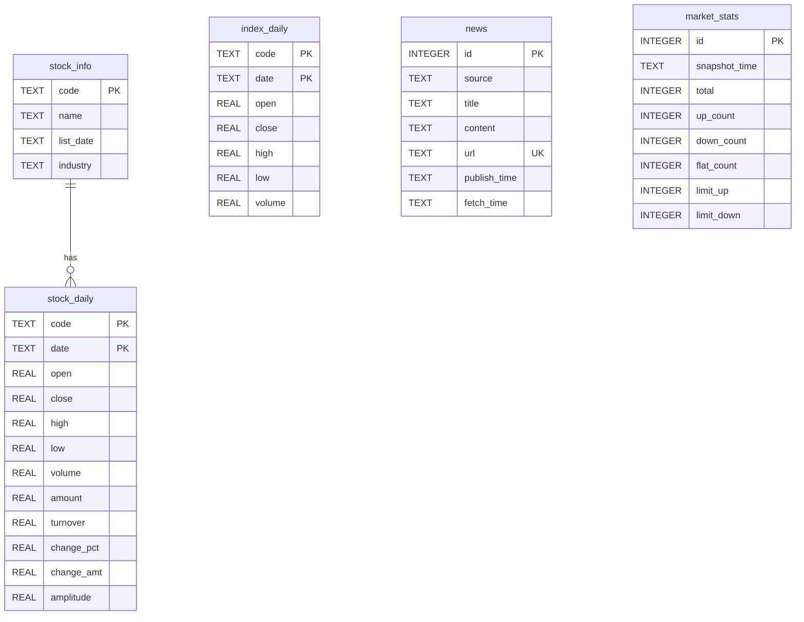

# 第1周：Python 基础 + pandas 入门

> 阶段：基础 | 难度：入门 | 核心文件：`smilex/config.py`、`smilex/store.py`

## 本周目标

- 理解 Python 与 Java 的核心语法差异，能用 Python 写出常见的数据处理逻辑
- 掌握 pandas DataFrame 的基本操作（筛选、排序、分组、聚合）
- 精读 `config.py` 和 `store.py`，理解项目的配置管理与数据持久化方案

---

## Python vs Java 语法对照

| 概念 | Java | Python |
|------|------|--------|
| 类型系统 | 静态类型，必须声明变量类型 | 动态类型，可选类型提示（Type Hints） |
| 变量声明 | `String name = "hello";` | `name: str = "hello"` 或直接 `name = "hello"` |
| 字符串格式化 | `String.format("Price: %.2f", price)` | `f"Price: {price:.2f}"` |
| 列表操作 | `list.stream().filter(x -> x > 0).collect(toList())` | `[x for x in lst if x > 0]`（列表推导式） |
| 字典操作 | `Map<String, Object> map = new HashMap<>();` | `d = {"key": "value"}` |
| 类定义 | `class Foo { ... }`，构造方法与类同名 | `class Foo: def __init__(self): ...` |
| 包管理 | Maven / Gradle（pom.xml） | uv / pip（pyproject.toml） |
| 异常处理 | `try { ... } catch (Exception e) { ... }` | `try: ... except Exception as e: ...` |
| Lambda | `(x, y) -> x + y` | `lambda x, y: x + y` |
| 空值处理 | `null`，`Optional<T>` | `None`，`if x is None:` |
| 多返回值 | 用 DTO / Record 包装 | `return a, b` 然后用 `x, y = func()` 解包 |
| 装饰器/注解 | `@Override`（编译时注解） | `@decorator`（运行时高阶函数包装） |
| 入口方法 | `public static void main(String[] args)` | `if __name__ == "__main__":` |

### 代码对照 1：遍历与过滤

```java
// Java - 过滤正数并求平方
List<Integer> result = numbers.stream()
    .filter(x -> x > 0)
    .map(x -> x * x)
    .collect(Collectors.toList());
```

```python
# Python - 列表推导式
result = [x * x for x in numbers if x > 0]
```

### 代码对照 2：类定义

```java
// Java
public class StockConfig {
    private final int maPeriod = 5;

    public int getMaPeriod() { return maPeriod; }
}
```

```python
# Python
class StockConfig:
    def __init__(self):
        self.ma_period: int = 5

# Python 还可以直接用模块级常量（本项目采用的方式）
MA_PERIOD = 5
```

### 代码对照 3：异常处理

```java
// Java
try {
    conn.createStatement().execute(sql);
} catch (SQLException e) {
    logger.error("DB error", e);
} finally {
    conn.close();
}
```

```python
# Python（推荐用 with 语句自动管理资源）
try:
    conn.execute(sql)
except sqlite3.Error as e:
    print(f"DB error: {e}")
# 或者用 with 语句：
with sqlite3.connect(DB_PATH) as conn:
    conn.execute(sql)  # 自动提交/回滚
```

---

## pandas 核心概念

pandas 是 Python 数据分析的基石。对于 Java 开发者，可以这样类比：

- **DataFrame** 类似于一个表格 / `List<Map<String, Object>>`，但底层用 C 实现，性能远超 Java 手写循环
- **Series** 类似于单列 / `List<T>`，是 DataFrame 的一列

### 核心操作示例

```python
import pandas as pd

# 创建 DataFrame（类似创建一张表）
df = pd.DataFrame({
    "code": ["000001", "000002", "600036"],
    "close": [12.5, 8.3, 35.2],
    "volume": [100000, 200000, 150000],
})

# 1. 过滤（布尔索引）— 类似 SQL 的 WHERE
big_volume = df[df["volume"] > 120000]

# 2. 排序 — 类似 SQL 的 ORDER BY
sorted_df = df.sort_values("close", ascending=False)

# 3. 分组聚合 — 类似 SQL 的 GROUP BY
summary = df.groupby("code")["close"].mean()

# 4. 新增计算列
df["avg_price"] = df["close"].rolling(window=2).mean()

# 5. 读取 SQL 查询结果
conn = sqlite3.connect("stock.db")
df = pd.read_sql("SELECT * FROM stock_daily WHERE code = ?", conn, params=["000001"])
```

> **关键理解**：pandas 的所有操作都是**向量化的**（对整列同时计算），不需要写 for 循环。这和 Java 中用 Stream API 的思路类似，但语法更简洁、性能更高。

---

## 代码精读：config.py

```python
import os

# os.path.dirname(os.path.abspath(__file__)) → 当前文件所在目录（smilex/）
# 再取 dirname → 项目根目录
BASE_DIR = os.path.dirname(os.path.dirname(os.path.abspath(__file__)))

# os.path.join 自动处理路径分隔符（Windows 用 \，Linux 用 /）
DATA_DIR = os.path.join(BASE_DIR, "data")       # 数据目录
DB_PATH = os.path.join(DATA_DIR, "stock.db")    # SQLite 数据库路径
HISTORY_DIR = os.path.join(DATA_DIR, "history") # 历史数据备份目录

DEFAULT_START_DATE = "20210101"   # 默认拉取数据的起始日期
INITIAL_CAPITAL = 100000.0       # 初始资金（10万元，用于回测）

# --- 技术指标参数 ---
MA_SHORT_PERIOD = 5              # 短期均线周期（5日均线，即一周）
MA_LONG_PERIOD = 20              # 长期均线周期（20日均线，即一个月）
RSI_PERIOD = 14                  # RSI 相对强弱指标周期（14日是标准值）
BOLLINGER_PERIOD = 20            # 布林带周期
BOLLINGER_STD = 2                # 布林带标准差倍数

# --- 选股扫描参数 ---
SCANNER_MIN_LISTED_DAYS = 60     # 上市天数最少60天（排除次新股）
SCANNER_VOLUME_RATIO_MIN = 1.5   # 量比最低阈值（1.5倍以上视为放量）

# --- 仪表盘配置 ---
DASHBOARD_PORT = 8501            # Streamlit 默认端口
DASHBOARD_HOST = "0.0.0.0"      # 监听所有网络接口
```

**设计要点：**
- Python 中模块级常量用 `UPPER_SNAKE_CASE` 命名（与 Java 的 `static final` 一样）
- 没有 `class` 包裹，直接在模块顶层定义——Python 模块本身就是天然的命名空间
- `os.path.join()` 而非字符串拼接，保证跨平台兼容

---

## 代码精读：store.py

### init_db() — 数据库建表

```python
def init_db():
    conn = _conn()
    conn.executescript("""
        CREATE TABLE IF NOT EXISTS stock_info (...);   -- 股票基本信息
        CREATE TABLE IF NOT EXISTS stock_daily (...);  -- 日K线数据（联合主键 code+date）
        CREATE TABLE IF NOT EXISTS index_daily (...);  -- 指数日K线
        CREATE TABLE IF NOT EXISTS news (...);         -- 新闻资讯（url UNIQUE 去重）
        CREATE TABLE IF NOT EXISTS market_stats (...); -- 大盘统计快照
        CREATE INDEX IF NOT EXISTS idx_news_source ON news(source);
        CREATE INDEX IF NOT EXISTS idx_news_publish ON news(publish_time);
    """)
```

> **对比 Java**：这里没有用 ORM（如 Hibernate），而是直接写 SQL。对于数据分析项目，pandas + 原生 SQL 比 ORM 更灵活高效。

### save_daily() — 临时表 Upsert 模式

```python
def save_daily(df: pd.DataFrame):
    conn = _conn()
    # 第1步：只选取需要的列
    save_df = df[[c for c in cols if c in df.columns]].copy()
    # 第2步：把 DataFrame 写入临时表
    save_df.to_sql("_tmp_daily", conn, if_exists="replace", index=False)
    # 第3步：从临时表合并到正式表（INSERT OR REPLACE = Upsert）
    conn.execute("INSERT OR REPLACE INTO stock_daily SELECT * FROM _tmp_daily")
    # 第4步：删除临时表
    conn.execute("DROP TABLE _tmp_daily")
```

> **为什么要用临时表？** SQLite 的 `INSERT OR REPLACE` 需要逐行执行。通过临时表，我们可以一次性批量写入，然后一条 SQL 完成全量 upsert，性能远优于逐行操作。这类似于 Java 中先写临时文件再 rename 的思路。

### query_daily() — 参数化查询

```python
def query_daily(code: str, start_date: str = "", end_date: str = "") -> pd.DataFrame:
    sql = "SELECT * FROM stock_daily WHERE code = ?"
    params: list = [code]
    if start_date:
        sql += " AND date >= ?"
        params.append(start_date)
    # ... 拼接条件 ...
    df = pd.read_sql(sql, conn, params=params)  # 参数化查询，防止SQL注入
```

> **对比 Java**：这里的 `?` 占位符和 JDBC 的 `PreparedStatement` 完全一致。`pd.read_sql()` 直接将查询结果转为 DataFrame，相当于 JDBC ResultSet 到 List<DTO> 的自动映射。

### save_news() — INSERT OR IGNORE 去重

```python
def save_news(df: pd.DataFrame):
    save_df.to_sql("_tmp_news", conn, if_exists="replace", index=False)
    conn.execute(
        "INSERT OR IGNORE INTO news (...) SELECT ... FROM _tmp_news"
    )
```

> `INSERT OR IGNORE` 表示如果 `url`（UNIQUE 约束）已存在则跳过。与 `INSERT OR REPLACE` 的区别：IGNORE 保留旧数据，REPLACE 覆盖旧数据。

### 数据库 ER 图



---

## Java 对照：Spring Data JPA vs pandas + SQLite

| 对比维度 | Spring Data JPA | pandas + SQLite |
|----------|----------------|-----------------|
| ORM 映射 | `@Entity` 注解 + Repository | 无 ORM，SQL 直接读写 |
| 批量保存 | `repository.saveAll(list)` | `df.to_sql()` |
| 按ID查询 | `repository.findById(id)` | `pd.read_sql("SELECT ... WHERE id=?", conn, params=[id])` |
| 自定义查询 | `@Query("SELECT ...")` | 字符串拼接 + 参数列表 |
| 数据库迁移 | Flyway / Liquibase | `CREATE TABLE IF NOT EXISTS` |
| 事务管理 | `@Transactional` 注解 | `conn.commit()` 手动提交 |
| 去重策略 | `@Id` + merge | `INSERT OR IGNORE` / `INSERT OR REPLACE` |
| 适用场景 | 企业级 Web 应用 | 数据分析、量化回测 |

---

## 实践练习

1. **修改配置参数**：打开 `smilex/config.py`，将 `MA_SHORT_PERIOD` 改为 10，`BOLLINGER_STD` 改为 2.5，观察对后续技术指标计算的影响。

2. **手动建库测试**：在项目根目录运行 `python -c "from smilex.store import init_db; init_db()"`，然后用 `sqlite3 data/stock.db ".tables"` 验证 5 张表是否创建成功。

3. **用 pandas 操作 DataFrame**：参考 `store.py` 中 `query_daily()` 的用法，写一段代码查询某只股票的数据，并筛选出涨幅（`change_pct`）大于 3% 的交易日。

4. **理解 Upsert 模式**：对同一只股票连续调用两次 `save_daily()`，然后查询数据库，验证数据没有重复。思考 `INSERT OR REPLACE` 与 `INSERT OR IGNORE` 的行为差异。

5. **对比 Java 实现**：尝试用 Java + JDBC 实现一个简化版的 `save_daily()`，体会 pandas `to_sql` + 临时表模式相比逐行 `PreparedStatement` 的效率优势。

---

## 自测清单

- [ ] 能解释 Python 的动态类型与 Java 静态类型的区别，以及类型提示（Type Hints）的作用
- [ ] 能独立写出 pandas 的筛选、排序、分组聚合代码，不依赖 for 循环
- [ ] 能解释 `save_daily()` 中临时表 upsert 模式的原理和优势
- [ ] 能画出 5 张数据库表的 ER 关系图，说明每张表的用途
- [ ] 能用参数化 SQL 查询（`?` 占位符）实现条件查询，避免 SQL 注入

---

## 学习资料

- [Python 官方教程（中文）](https://docs.python.org/zh-cn/3/tutorial/index.html) — 系统学习 Python 基础语法
- [pandas 官方文档](https://pandas.pydata.org/docs/user_guide/index.html) — 权威参考，重点看 10 Minutes to pandas 和 DataFrame 章节
- 《利用 Python 进行数据分析》（Wes McKinney 著）— pandas 作者亲笔，数据分析入门经典
- [CSDN pandas 股票分析教程](https://blog.csdn.net/) — 搜索 "pandas 股票数据分析" 可找到大量实战案例
- [菜鸟教程 pandas](https://www.runoob.com/pandas/pandas-tutorial.html) — 快速查阅 API 用法
