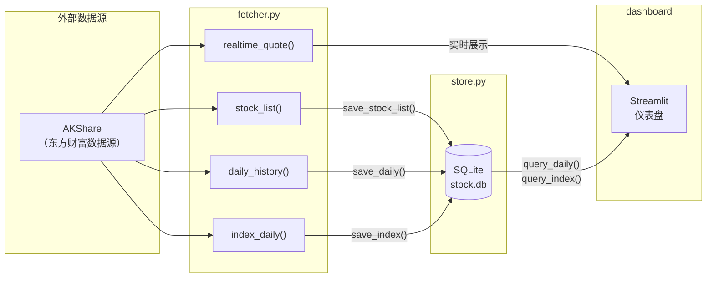

# 第2周：数据获取（AKShare + fetcher.py）

> 阶段：基础 | 难度：入门 | 核心文件：`smilex/fetcher.py`

## 本周目标

- 理解 A 股 OHLCV 数据结构和股票代码规则
- 掌握 AKShare 的数据获取接口，精读 `fetcher.py` 的每个函数
- 理解前复权（qfq）的数学原理及其对量化分析的重要性

---

## A股数据基础

### OHLCV 数据结构

每根 K 线（交易日）包含 5 个核心字段：

| 字段 | 英文 | 含义 |
|------|------|------|
| 开盘价 | Open | 当天第一笔成交价 |
| 最高价 | High | 当天最高成交价 |
| 最低价 | Low | 当天最低成交价 |
| 收盘价 | Close | 当天最后一笔成交价 |
| 成交量 | Volume | 当天总成交股数 |

> K 线图（蜡烛图）通过这 5 个数据画出一根"蜡烛"：实体部分是 Open 和 Close 之间的矩形，上下影线分别延伸到 High 和 Low。收盘 > 开盘为阳线（红色），反之为阴线（绿色）。

### 股票代码规则

| 代码前缀 | 交易所 | 示例 |
|----------|--------|------|
| 6xxxxx | 上海证券交易所（上交所） | 600036 招商银行 |
| 0xxxxx | 深圳证券交易所主板（深交所） | 000001 平安银行 |
| 3xxxxx | 深圳证券交易所创业板 | 300750 宁德时代 |

### 主要指数代码

| 指数名称 | 代码 | 说明 |
|----------|------|------|
| 上证指数 | 000001 | 上海市场综合指数 |
| 深证成指 | 399001 | 深圳市场成份指数 |
| 创业板指 | 399006 | 创业板综合指数 |

> 注意：上证指数和深证成指的数字代码都是"000001"，但在不同交易所。AKShare 的 `stock_zh_index_daily` 接口需要加市场前缀区分：`sh000001`（上证）vs `sz399001`（深证）。

---

## 数据接口库对比

| 对比维度 | AKShare | Tushare | BaoStock |
|----------|---------|---------|----------|
| 费用 | 免费 | 部分免费，高级接口需积分 | 免费 |
| 注册要求 | 无需注册 | 需注册获取 token | 无需注册 |
| 数据范围 | A股、基金、期货、宏观等 | A股、基金、期货等 | A股、指数 |
| 数据频率 | 日线、分钟线、实时 | 日线、分钟线、Tick | 日线、分钟线 |
| 接口风格 | 函数式，返回 DataFrame | 函数式，返回 DataFrame | 函数式，返回 DataFrame |
| 维护活跃度 | 高（社区活跃） | 高（商业运营） | 中等 |
| 本项目选择 | **已采用** | - | - |

> 本项目选择 AKShare 的原因：免费无需注册、覆盖面广、社区活跃、接口命名直观。

---

## 代码精读：fetcher.py

### stock_list() — 获取股票列表

```python
def stock_list() -> pd.DataFrame:
    # 第1步：调用 AKShare 获取沪深A股实时行情（含所有股票）
    df = ak.stock_zh_a_spot_em()
    # 第2步：过滤 ST 和退市股票（名称中包含"ST"或"退"的排除）
    df = df[~df["名称"].str.contains("ST|退", na=False)]
    # 第3步：将中文列名重命名为英文（数据清洗的核心步骤）
    df = df.rename(columns={
        "序号": "seq", "代码": "code", "名称": "name",
        "最新价": "price", "涨跌幅": "change_pct",
        ...
    })
    # 第4步：只保留需要的列
    df = df[["code", "name", "price", "change_pct", ...]]
    # 第5步：重置索引
    return df.reset_index(drop=True)
```

> **Java 对照**：这段代码相当于 `List<StockDTO> -> stream().filter().map()`，但用 pandas 的向量化操作，代码量减少 80%。

### daily_history() — 获取日K线

```python
def daily_history(code: str, start_date: str = DEFAULT_START_DATE,
                  end_date: str = "", adjust: str = "qfq") -> pd.DataFrame:
    df = ak.stock_zh_a_hist(
        symbol=code,       # 股票代码，如 "000001"
        period="daily",    # 日线（还有 weekly、monthly）
        start_date=start_date,  # 默认从 20210101 开始
        end_date=end_date,      # 留空表示到最新
        adjust=adjust,          # "qfq" = 前复权
    )
    df = df.rename(columns={...})  # 中文列名 → 英文
    df["date"] = pd.to_datetime(df["date"])  # 字符串 → 日期类型
    df["code"] = code                         # 添加股票代码列
    return df.reset_index(drop=True)
```

> **关键参数 `adjust`**：控制复权方式，详见下方"前复权详解"。

### index_daily() — 获取指数日K线

```python
def index_daily(symbol: str = "000001", start_date: str = DEFAULT_START_DATE):
    # AKShare 的指数接口需要带市场前缀
    if not symbol.startswith(("sh", "sz")):
        prefix = "sh" if symbol.startswith(("000", "5")) else "sz"
        full_symbol = f"{prefix}{symbol}"
    else:
        full_symbol = symbol

    df = ak.stock_zh_index_daily(symbol=full_symbol)
    df = df[df["date"] >= pd.to_datetime(start_date)]  # 日期过滤
    df["code"] = symbol  # 保留原始代码（不带前缀）
    return df.reset_index(drop=True)
```

> **市场前缀逻辑**：上交所代码以 000 或 5 开头（如 000001 上证指数、510050 50ETF），加 `sh` 前缀；深交所以其他数字开头，加 `sz` 前缀。

### sector_list() / realtime_quote() / stock_info()

```python
def sector_list() -> pd.DataFrame:
    """获取东方财富行业板块列表"""
    df = ak.stock_board_industry_name_em()
    return df.reset_index(drop=True)

def realtime_quote() -> pd.DataFrame:
    """获取A股实时行情快照（全部股票）"""
    df = ak.stock_zh_a_spot_em()
    return df.reset_index(drop=True)  # 原始中文列名，未做重命名

def stock_info(code: str) -> pd.DataFrame:
    """获取个股基本信息（公司概况、行业、上市日期等）"""
    df = ak.stock_individual_info_em(symbol=code)
    return df  # 返回原始格式（两列：item / value）
```

### 数据流图



---

## 前复权详解

### 什么是复权？

股票在分红、送股后，价格会产生"断层"。例如一只股票 100 元，每 10 股派 10 元（即每股分红 1 元），分红后股价理论上跳到 99 元。如果不处理，K 线图上会出现一个向下的跳空缺口，误导技术分析。

### 三种复权方式对比

以具体例子说明——某股票收盘价 100 元，次日每股分红 1 元：

| 复权方式 | 分红前价格 | 分红后价格 | 特点 |
|----------|-----------|-----------|------|
| 不复权 | 100.00 | 99.00 | 真实交易价格，但有断层 |
| 前复权（qfq） | 99.00 | 99.00 | **历史价格向下调整**，最新价不变，K线连续 |
| 后复权（hfq） | 100.00 | 100.00 | **最新价格向上调整**，反映真实总收益 |

### 前复权的计算逻辑

前复权的核心公式：将分红日之前的所有历史价格，按比例向下调整。

```
调整系数 = (分红前收盘价 - 每股分红) / 分红前收盘价
调整后历史价 = 原历史价 × 调整系数
```

> **本项目使用前复权（qfq）**，原因是：前复权保持了最新价格与实际市场价一致，方便技术分析时对比当前价位。绝大多数量化平台默认使用前复权。

---

## 数据清洗五步模式

`fetcher.py` 中的每个函数都遵循统一的数据清洗流程：

```
原始数据（中文列名）→ 过滤（排除无效数据）→ 重命名（中文→英文）→ 选列（只保留需要的）→ 重置索引
```

### 第1步：获取原始数据

```python
df = ak.stock_zh_a_spot_em()  # 返回的列名是中文：代码、名称、涨跌幅...
```

### 第2步：过滤无效数据

```python
df = df[~df["名称"].str.contains("ST|退", na=False)]  # 排除ST和退市股
```

### 第3步：重命名列

```python
df = df.rename(columns={"代码": "code", "名称": "name", ...})
```

### 第4步：选取需要的列

```python
df = df[["code", "name", "price", "change_pct"]]
```

### 第5步：重置索引

```python
df = df.reset_index(drop=True)  # 丢弃旧索引，从0重新编号
```

> **为什么要做这些步骤？** AKShare 返回的原始数据列名是中文，且包含大量我们不需要的列。统一清洗为英文列名后，后续的指标计算、数据库存储才能正常工作。

---

## pandas 核心操作详解

### rename() — 列名重命名

```python
# 方式1：传入字典映射
df = df.rename(columns={"旧名": "新名", "代码": "code"})

# 方式2：批量重命名（函数式）
df = df.rename(columns=str.upper)  # 所有列名转大写
```

### str.contains() — 字符串匹配过滤

```python
# 正则匹配：名称包含"ST"或"退"的行
st_stocks = df[df["名称"].str.contains("ST|退", na=False)]

# ~ 取反：排除这些行
clean = df[~df["名称"].str.contains("ST|退", na=False)]
```

> 类似 Java 的 `str.matches(".*ST.*|.*退.*")`，但作用于整列，自动处理 null 值（`na=False` 表示 null 行不匹配）。

### to_datetime() — 日期类型转换

```python
# 字符串 → datetime64
df["date"] = pd.to_datetime(df["date"])

# 转换后可以做日期比较
start = pd.to_datetime("20210101")
df = df[df["date"] >= start]
```

### reset_index() — 重置索引

```python
# 过滤后索引不连续，重置为 0, 1, 2, ...
df = df.reset_index(drop=True)

# drop=True 表示丢弃旧索引（不作为新列保留）
```

---

## 实践练习

1. **获取股票列表**：调用 `fetcher.stock_list()`，打印返回的 DataFrame 的 shape（行数和列数），查看前 5 行（`df.head()`）和列名（`df.columns`）。

2. **获取单只股票K线**：调用 `fetcher.daily_history("000001")` 获取平安银行的日K线数据，计算该股票的总交易天数、最高价、最低价、平均成交量。

3. **对比复权方式**：分别用 `adjust="qfq"` 和 `adjust=""`（不复权）获取同一只股票的数据，对比分红前后的价格差异。

4. **理解市场前缀**：在 `index_daily()` 中，分别传入 `"000001"`、`"399001"`、`"399006"`，验证生成的 `full_symbol` 是否正确（应为 `sh000001`、`sz399001`、`sz399006`）。

5. **实现数据清洗流水线**：参考五步清洗模式，从 `realtime_quote()` 获取原始数据，自行完成列名重命名、过滤涨幅大于 5% 的股票、按成交额降序排列。

---

## 自测清单

- [ ] 能解释 OHLCV 五个字段的含义，以及阳线和阴线的判断方式
- [ ] 能说出上证指数（000001）与平安银行（000001）的代码冲突是如何解决的
- [ ] 能解释前复权（qfq）的数学原理，以及为什么量化分析必须用复权数据
- [ ] 能独立使用 AKShare 获取任意股票的日K线数据并做基本的数据清洗
- [ ] 能画出"AKShare → fetcher.py → store.py → 仪表盘"的完整数据流图

---

## 学习资料

- [AKShare 官方文档](https://akshare.akfamily.xyz/) — 数据接口的权威参考
- [AKShare GitHub 仓库](https://github.com/akfamily/akshare) — 源码和更新日志
- [AKShare 入门教程](https://akshare.akfamily.xyz/tutorial.html) — 官方使用教程
- [东方财富数据接口说明](https://data.eastmoney.com/) — 了解数据源头
- [股票复权详解（知乎）](https://www.zhihu.com/) — 搜索"股票前复权 后复权 区别"可找到多篇优质回答
