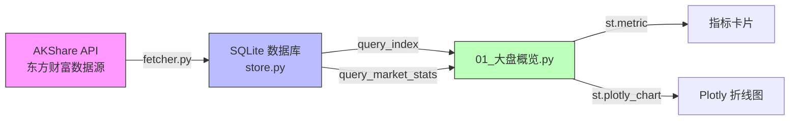

# 第4周：Streamlit 看板 + 大盘概览

> 阶段：基础 | 难度：入门 | 核心文件：`dashboard/pages/01_大盘概览.py`

## 本周目标

- 能启动 Streamlit 看板并看懂大盘页面代码
- 理解 Streamlit 组件模型（与 Spring Boot + Thymeleaf 的区别）
- 掌握 Plotly 折线图和指标卡片的基本用法

---

## Streamlit 快速入门（Java 开发者视角）

如果你是 Java 全栈开发者，已经熟悉 Spring Boot + Thymeleaf 的开发模式，下面这张对比表能帮你快速理解 Streamlit 的设计哲学。

### Spring Boot vs Streamlit 对比表

| 维度 | Spring Boot + Thymeleaf | Streamlit |
|------|------------------------|-----------|
| **UI 构建** | HTML 模板 + Thymeleaf 表达式 | 纯 Python 代码，无 HTML |
| **交互模型** | HTTP 请求-响应，Controller 处理 | 每次交互重新执行整个脚本（rerun） |
| **组件模型** | Thymeleaf fragment / JSP tag | `st.xxx()` 函数调用，自上而下排列 |
| **状态管理** | HttpSession / Request scope | `st.session_state`（字典式键值存储） |
| **页面路由** | @Controller + @RequestMapping | `pages/` 目录自动识别文件名 |
| **部署方式** | WAR/JAR 包部署到 Tomcat | `streamlit run app.py`，默认端口 8501 |
| **数据绑定** | Model → Thymeleaf → HTML | Python 变量直接渲染 |

**关键思维转换**：Streamlit 没有 Controller、Service、View 的分层。一个 `.py` 文件既是后端又是前端，数据获取和 UI 渲染写在同一个脚本里。

### Streamlit 核心概念

**1. Rerun 模型（最重要的概念）**

每次用户与页面交互（点击按钮、修改输入框、选择下拉框），Streamlit 会从头到尾重新执行整个 Python 脚本。这与 Spring Boot 的"一个请求走一个方法"完全不同。

```
用户点击按钮 → 脚本从第1行重新执行到最后 → 生成新的页面内容
```

**2. st.session_state（类比 HttpSession）**

由于每次 rerun 都会丢失变量，需要跨 rerun 保存的数据必须放入 `st.session_state`：

```python
# 类比 Java: session.setAttribute("count", 0)
if "count" not in st.session_state:
    st.session_state.count = 0

st.session_state.count += 1
st.write(f"你已经点击了 {st.session_state.count} 次")
```

**3. 组件层级**

Streamlit 页面是自上而下的线性布局，常用层级：

```
sidebar（侧边栏）
  └── selectbox / date_input（输入控件）
columns（多列布局）
  ├── metric（指标卡片）
  ├── metric
  └── metric
plotly_chart（图表）
dataframe（数据表格）
```

**4. 多页应用**

SmileX 使用 Streamlit 的多页模式：把页面放在 `dashboard/pages/` 目录下，文件名前缀数字决定排序。例如：

```
dashboard/
├── app.py                          # 入口
└── pages/
    ├── 01_大盘概览.py               # 第一页
    ├── 02_今日推荐.py               # 第二页
    └── 03_个股分析.py               # 第三页
```

### 核心 API 速查

```python
import streamlit as st

# ---- 标题与文本 ----
st.title("页面大标题")        # <h1>
st.header("章节标题")         # <h2>
st.subheader("子标题")        # <h3>
st.text("纯文本")             # <pre>
st.markdown("**Markdown**")   # Markdown 渲染
st.caption("说明文字")        # 小字注释

# ---- 布局 ----
col1, col2, col3 = st.columns(3)    # 三列等宽布局
with col1:
    st.metric("指标名", "值", "变化量")  # KPI 卡片

# ---- 数据展示 ----
st.dataframe(df, use_container_width=True)  # 交互式数据表
st.json({"key": "value"})                   # JSON 展示

# ---- 图表 ----
st.line_chart(df, x="date", y="close")      # 简单折线图
st.bar_chart(df, x="date", y="volume")      # 简单柱状图
st.plotly_chart(fig, use_container_width=True)  # Plotly 图表

# ---- 侧边栏 ----
st.sidebar.title("设置")
option = st.sidebar.selectbox("选择", ["A", "B"])

# ---- 输入控件 ----
code = st.text_input("股票代码", value="000001")
date = st.date_input("选择日期")
btn = st.button("运行", type="primary")

# ---- 状态提示 ----
st.info("提示信息")       # 蓝色
st.success("成功信息")    # 绿色
st.warning("警告信息")    # 黄色
st.error("错误信息")      # 红色
```

---

## A股市场结构

在读懂大盘概览页面之前，需要了解 A 股市场的基本结构。

### 四大板块区别

| 板块 | 交易所 | 代码前缀 | 涨跌停限制 | 上市门槛 |
|------|--------|----------|-----------|---------|
| **主板** | 上交所 / 深交所 | 60xxxx / 000xxx | ±10% | 盈利要求严格 |
| **创业板** | 深交所 | 300xxx | ±20% | 允许亏损企业上市 |
| **科创板** | 上交所 | 688xxx | ±20% | 研发投入占比要求 |
| **北交所** | 北交所 | 8xxxxx / 4xxxxx | ±30% | 中小企业为主 |

SmileX 项目大盘概览页面跟踪的三大指数：

```python
INDICES = {
    "上证指数": "000001",    # 上交所主板核心指数
    "深证成指": "399001",    # 深交所核心成分指数
    "创业板指": "399006",    # 创业板核心指数
}
```

### 交易制度要点

- **交易时间**：上午 9:30 - 11:30，下午 13:00 - 15:00
- **T+1 交割**：今天买入的股票，明天才能卖出（与美股 T+0 不同）
- **涨跌停板**：主板 ±10%，创业板和科创板 ±20%，ST 股 ±5%
- **集合竞价**：9:15-9:25（开盘竞价），14:57-15:00（收盘竞价）
- **最小交易单位**：1 手 = 100 股

### 指数编制三要素

理解指数如何编制，才能正确使用指数判断市场走势：

1. **样本选择**：全样本指数（如上证指数）vs 成分指数（如沪深300）
2. **加权方式**：市值加权（主流）、等权重、价格加权
3. **调整频率**：半年一次（主流）、季度调整

### 市场情绪指标

大盘概览页面展示了几个关键的市场情绪指标：

- **涨跌比率** = 上涨家数 / 下跌家数。>1.5 市场偏强，<0.5 市场偏弱
- **涨停家数激增** → 市场过热信号，需警惕短期回调
- **市场广度** = 上涨家数 / 总家数，反映市场参与度

---

## 代码精读：01_大盘概览.py

下面逐段解读大盘概览页面的代码。

### 数据加载

```python
from smilex.store import query_index, query_market_stats, init_db

init_db()  # 确保数据库表结构存在（类比 Spring 的 @PostConstruct）
```

页面从 SQLite 数据库读取数据，不直接调用 AKShare API。数据由后台定时任务同步到数据库中。

### 三大指数卡片

```python
col1, col2, col3 = st.columns(3)  # 创建三列等宽布局

for i, (name, code) in enumerate(INDICES.items()):
    col = [col1, col2, col3][i]
    with col:
        df = query_index(code, start_date="2025-01-01")  # 查询指数数据
        if not df.empty:
            latest = df.iloc[-1]  # DataFrame 最后一行 = 最新一天
            # 计算涨跌幅
            change = ((latest["close"] - df.iloc[-2]["close"])
                      / df.iloc[-2]["close"] * 100)
            # 渲染指标卡片
            st.metric(label=name, value=f"{latest['close']:.2f}",
                      delta=f"{change:.2f}%")
```

关键点：
- `df.iloc[-1]` 取最新一行，`df.iloc[-2]` 取前一行
- `st.metric()` 的 `delta` 参数正值显示绿色向上箭头，负值显示红色向下箭头
- 每个指数下面紧跟一个趋势折线图

### 指数趋势图

```python
fig = go.Figure()
fig.add_trace(go.Scatter(x=df["date"], y=df["close"], name=name))
fig.update_layout(height=300, margin=dict(l=0, r=0, t=20, b=0))
st.plotly_chart(fig, use_container_width=True)
```

用 Plotly 绘制收盘价折线图。`use_container_width=True` 让图表自适应容器宽度。

### 市场统计

```python
stats = query_market_stats()  # 查询最新的市场快照
row = stats.iloc[0]           # 取最新一条记录
c1, c2, c3, c4 = st.columns(4)
c1.metric("上涨", f"{int(row['up_count'])} 只")
c2.metric("下跌", f"{int(row['down_count'])} 只")
c3.metric("平盘", f"{int(row['flat_count'])} 只")
c4.metric("总股票数", f"{int(row['total'])} 只")
```

市场统计数据来自 `market_stats` 表，由定时任务采集并存储。

---

## Plotly 入门

Plotly 是 Python 的交互式图表库，SmileX 项目中使用 `plotly.graph_objects`（简称 `go`）来绘制图表。

### go.Scatter 折线图

```python
import plotly.graph_objects as go

fig = go.Figure()
fig.add_trace(go.Scatter(
    x=df["date"],       # X 轴：日期
    y=df["close"],      # Y 轴：收盘价
    name="收盘价",       # 图例名称
    line=dict(color="blue", width=2),  # 线条样式
))
fig.show()  # 在浏览器中显示 / Streamlit 中用 st.plotly_chart(fig)
```

### go.Figure + fig.add_trace()

Plotly 的图表由 Figure（画布）和 Trace（数据系列）组成：

```python
fig = go.Figure()                    # 创建画布
fig.add_trace(go.Scatter(...))       # 添加数据系列1
fig.add_trace(go.Scatter(...))       # 添加数据系列2
fig.add_trace(go.Bar(...))           # 添加柱状图系列
```

### Layout 自定义

```python
fig.update_layout(
    title="图表标题",
    height=300,                       # 图表高度（像素）
    margin=dict(l=0, r=0, t=20, b=0), # 四边距（left/right/top/bottom）
    xaxis_title="日期",
    yaxis_title="价格",
    showlegend=True,
)
```

### 在 Streamlit 中显示

```python
st.plotly_chart(fig, use_container_width=True)
```

`use_container_width=True` 是最佳实践，让图表宽度跟随 Streamlit 容器自适应。

---

## 数据流全景

大盘概览页面的数据从 API 到屏幕的完整路径：



数据流说明：

1. **fetcher.py** 调用 AKShare 库从东方财富获取实时行情数据
2. **store.py** 将数据写入 SQLite 数据库（`index_daily` 和 `market_stats` 表）
3. **01_大盘概览.py** 从数据库查询数据，渲染到 Streamlit 页面
4. 后台定时任务负责定期同步数据，页面只负责读取和展示

---

## 实践练习

### 练习1：追踪数据流

打开 `smilex/store.py`，找到 `query_index()` 函数。回答以下问题：
- SQL 查询语句是什么？
- `start_date` 参数如何影响查询结果？
- 返回的 DataFrame 包含哪些列？

### 练习2：添加第四个指数

在 `01_大盘概览.py` 的 `INDICES` 字典中添加沪深300指数：

```python
INDICES = {
    "上证指数": "000001",
    "深证成指": "399001",
    "创业板指": "399006",
    "沪深300": "000300",    # 新增
}
```

需要将 `st.columns(3)` 改为 `st.columns(4)`，并调整循环中的列映射。

### 练习3：添加涨跌比率指标

在市场概况区域，添加涨跌比率的计算和展示：

```python
if row['down_count'] > 0:
    ratio = row['up_count'] / row['down_count']
    st.metric("涨跌比", f"{ratio:.2f}")
```

### 练习4：自定义图表颜色

修改 Plotly 折线图的样式，让三个指数用不同颜色区分：

```python
colors = {"上证指数": "red", "深证成指": "blue", "创业板指": "green"}
fig.add_trace(go.Scatter(
    x=df["date"], y=df["close"], name=name,
    line=dict(color=colors.get(name, "gray"), width=2),
))
```

### 练习5：理解 rerun 模型

在页面顶部添加一个计数器，每次用户操作页面时观察计数变化：

```python
if "visit_count" not in st.session_state:
    st.session_state.visit_count = 0
st.session_state.visit_count += 1
st.caption(f"页面第 {st.session_state.visit_count} 次渲染")
```

---

## 自测清单

完成本周学习后，确认你能回答以下问题：

- [ ] 能解释 Streamlit 的 rerun 模型与 Spring Boot 请求响应的区别
- [ ] 能说出 `st.metric()`、`st.columns()`、`st.plotly_chart()` 的用途
- [ ] 能画出从 AKShare API 到页面显示的完整数据流
- [ ] 能解释涨跌比率、涨停家数等市场情绪指标的含义
- [ ] 能独立修改大盘概览页面，添加新的指标卡片或图表

---

## 学习资料

- [Streamlit 官方文档](https://docs.streamlit.io/) - 入门必读
- [st.metric API](https://docs.streamlit.io/library/api-reference/data/st.metric) - 指标卡片详解
- [st.columns API](https://docs.streamlit.io/library/api-reference/layout/st.columns) - 多列布局
- [Plotly Python 文档](https://plotly.com/python/) - 图表库文档
- [AKShare 文档](https://akshare.akfamily.xyz/) - A 股数据接口
- B站搜索"Streamlit 入门教程" - 视频学习
- B站搜索"A股入门 市场结构" - 了解 A 股市场基础
