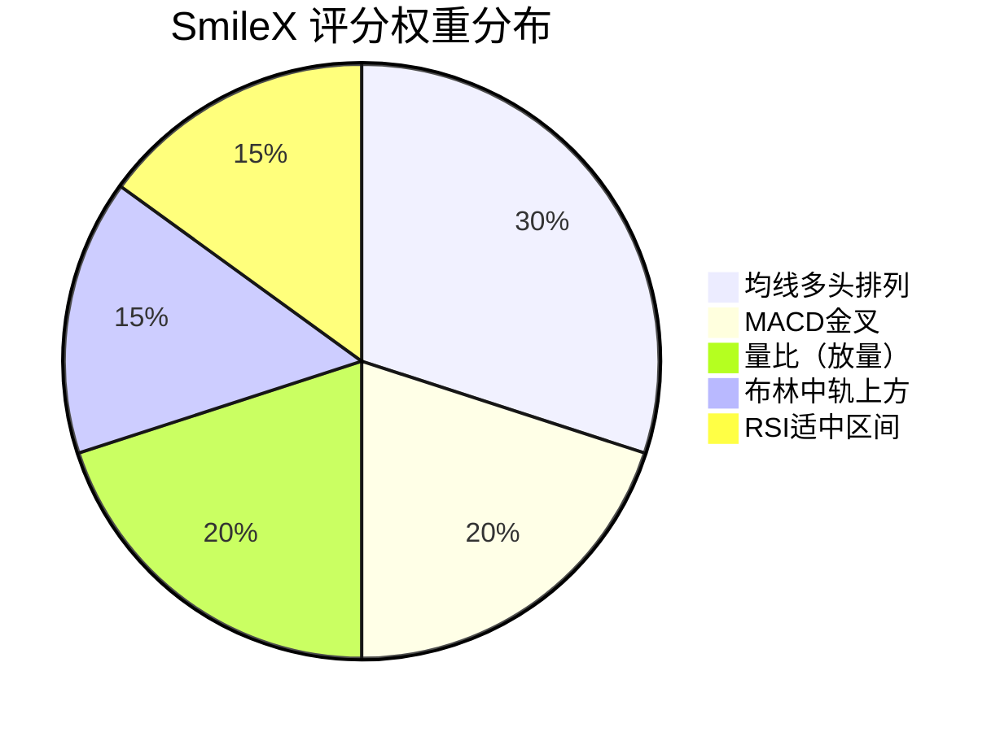
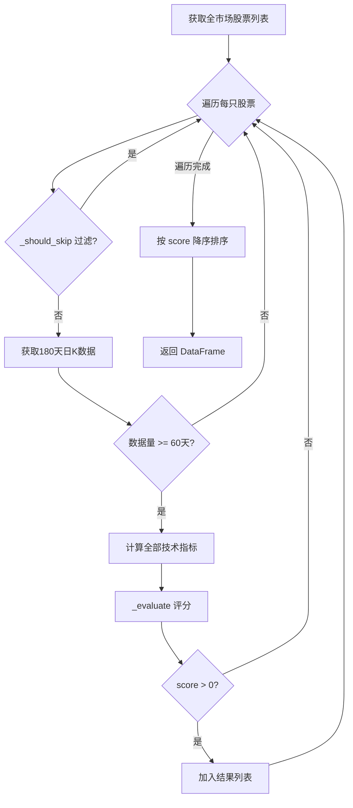

# 第5周：多因子选股（scanner.py）

> 阶段：核心 | 难度：中级 | 核心文件：`smilex/scanner.py`、`dashboard/pages/02_今日推荐.py`

## 本周目标

- 理解多因子选股模型的原理和设计思路
- 能读懂 scanner.py 的评分逻辑和过滤规则
- 能修改评分权重并运行全市场扫描

---

## 多因子选股模型原理

### 什么是多因子选股？

多因子选股的本质是：将多个独立的判断条件各自赋分，按总分排序，选出综合得分最高的股票。类比 Java 开发中的"多维度评估"：

```
面试评分 = 项目经验(30分) + 技术深度(25分) + 沟通能力(20分) + 学习能力(15分) + 文化匹配(10分)
```

股票评分也是同样思路：

```
股票评分 = 均线排列(30分) + MACD金叉(20分) + 量比(20分) + 布林中轨(15分) + RSI适中(15分)
```

### 因子分类

量化投资中的因子通常分为以下几类：

| 因子类别 | 说明 | 示例 |
|---------|------|------|
| **估值因子** | 衡量价格是否合理 | PE（市盈率）、PB（市净率） |
| **质量因子** | 衡量公司基本面 | ROE（净资产收益率）、资产负债率 |
| **动量因子** | 衡量价格趋势强度 | 过去N日涨幅、均线排列 |
| **技术因子** | 衡量技术面状态 | MACD、RSI、KDJ、布林带 |
| **情绪因子** | 衡量市场参与度 | 量比、换手率、资金流向 |

### SmileX 的 5 因子模型

本项目使用技术因子为主，总分 100 分：



### 进阶方向（了解即可）

SmileX 的评分模型是简化版。真实的量化基金会使用更高级的方法：

- **IC/IR 值**：衡量因子预测能力（IC > 0.03 有实用价值）
- **因子中性化**：消除行业、市值等干扰因素
- **动态加权**：根据市场环境动态调整因子权重
- **因子正交化**：去除因子间的相关性重叠

---

## 评分权重设计思路

理解"为什么是这个权重"比记住权重本身更重要。

### 均线排列 30分 -- 趋势核心

**为什么最高分？** 均线多头排列（MA5 > MA10 > MA20 > MA60）代表短期、中期、长期趋势完全一致向上。这是趋势交易最核心的信号，多重时间周期共振的可靠性最高。

如果一只股票所有均线都在"正确的位置"，说明趋势已经确立并且延续性较强。

### MACD金叉 20分 -- 趋势确认

**为什么第二高？** MACD 是趋势确认型指标。DIF 上穿 DEA（金叉）表示短期动能增强。MACD 不宜单独使用，但作为均线的确认信号很有价值。

注意代码中的"即将金叉"也给 10 分（差距 < 5%），这是提前布局的逻辑。

### 量比 20分 -- 量价配合

**为什么重要？** 股市有句老话"量在价先"。量比 > 1.5 说明今天的成交量明显放大，代表有资金在积极参与。无量上涨是虚假信号，放量上涨才可信。

### 布林中轨 15分 -- 辅助确认

**为什么中等权重？** 布林中轨本质上是 20 日均线。股价站在布林中轨上方，说明股价处于近 20 日的上半区间，处于相对强势。这是辅助确认，不是决定性信号。

### RSI适中 15分 -- 排除极端

**为什么是排除而非追逐？** RSI > 70 是超买（过高），RSI < 40 是超卖（过低）。40-70 的适中区间代表股票没有过度买入或卖出。这个因子的作用是"排雷"而非"追涨"。

注意代码中 RSI < 40 也给 5 分（偏低），这是在弱势中寻找反弹机会。

---

## 代码精读：scanner.py

### daily_scan() -- 主流程

```python
def daily_scan() -> pd.DataFrame:
    """全市场扫描，返回推荐股票列表"""
```

整个扫描流程如下：



详细解读每一步：

**第1步：获取股票列表**

```python
stocks = stock_list()  # 调用 fetcher.py，获取沪深A股全量列表
```

**第2步：过滤和跳过**

```python
if _should_skip(row):
    continue  # 跳过 ST、退市、涨跌停等异常股票
```

**第3步：获取历史数据**

```python
start = (datetime.now() - timedelta(days=180)).strftime("%Y%m%d")
df = daily_history(code, start_date=start)  # 取近180天日K线
```

为什么取 180 天？因为 MA60（60日均线）需要至少 60 个交易日才有值，加上节假日，180 个自然日大约覆盖 120+ 个交易日。

**第4步：计算指标并评分**

```python
if len(df) < SCANNER_MIN_LISTED_DAYS:  # 默认 60 天
    continue  # 次新股数据不足，跳过

df = all_indicators(df)        # 计算全部技术指标
score, reasons = _evaluate(df.iloc[-1])  # 对最新一天评分
```

**第5步：收集结果**

```python
if score > 0:
    results.append({
        "code": code, "name": name,
        "price": round(df.iloc[-1]["close"], 2),
        "change_pct": round(df.iloc[-1].get("change_pct", 0), 2),
        "volume_ratio": round(df.iloc[-1].get("volume_ratio", 0), 2),
        "score": score,
        "reasons": "；".join(reasons),  # 用中文分号拼接推荐理由
    })
```

**第6步：排序返回**

```python
return pd.DataFrame(results).sort_values("score", ascending=False).reset_index(drop=True)
```

### _should_skip() -- 过滤规则

```python
def _should_skip(row) -> bool:
    name = str(row.get("name", ""))
    # 规则1：跳过 ST 和退市股 -- 高风险标的，不适合正常选股
    if "ST" in name or "退" in name:
        return True
    # 规则2：跳过涨跌停股 -- 涨停买不进，跌停卖不出
    change_pct = row.get("change_pct", 0)
    if pd.isna(change_pct) or abs(float(change_pct)) >= 9.9:
        return True
    # 规则3：跳过价格为0或异常的股票 -- 可能停牌或数据异常
    price = row.get("price", 0)
    if pd.isna(price) or float(price) <= 0:
        return True
    return False
```

过滤逻辑的设计哲学是"宁缺毋滥"：宁可漏掉一些好机会，也不要把异常股票选进来。

### _evaluate() -- 评分逻辑

逐条解读评分规则：

**规则1：均线多头排列（30分）**

```python
ma5 = latest.get("ma5")
ma10 = latest.get("ma10")
ma20 = latest.get("ma20")
ma60 = latest.get("ma60")

if all(pd.notna([ma5, ma10, ma20, ma60])):
    if ma5 > ma10 > ma20 > ma60:  # 短期 > 中期 > 长期
        score += 30
        reasons.append("均线多头排列")
```

`ma5 > ma10 > ma20 > ma60` 是 Python 的链式比较，等价于 `ma5 > ma10 and ma10 > ma20 and ma20 > ma60`。

注意 `pd.notna()` 检查：MA60 需要 60 个交易日才有值，数据不足时为 NaN，必须跳过。

**规则2：MACD 金叉（20分 / 即将金叉 10分）**

```python
dif = latest.get("macd_dif")
dea = latest.get("macd_dea")
if all(pd.notna([dif, dea])):
    if dif > dea:                          # DIF 在 DEA 上方 = 金叉状态
        score += 20
        reasons.append("MACD金叉")
    elif abs(dif - dea) / max(abs(dea), 0.01) < 0.05:
        # DIF 和 DEA 距离 < 5%，即将交叉
        score += 10
        reasons.append("MACD即将金叉")
```

`max(abs(dea), 0.01)` 防止除零错误。当 DEA 接近 0 时，用 0.01 作为除数。

**规则3：量比放量（20分）**

```python
vol_ratio = latest.get("volume_ratio", 0)
if pd.notna(vol_ratio) and vol_ratio > SCANNER_VOLUME_RATIO_MIN:
    score += 20
    reasons.append(f"放量(量比{vol_ratio:.1f})")
```

`SCANNER_VOLUME_RATIO_MIN` 默认值为 1.5（在 `config.py` 中配置），即成交量是近 5 日平均的 1.5 倍以上。

**规则4：布林中轨上方（15分）**

```python
close = latest.get("close", 0)
boll_mid = latest.get("boll_mid")
if pd.notna(boll_mid) and close > boll_mid:
    score += 15
    reasons.append("站上布林中轨")
```

**规则5：RSI 适中区间（15分 / 偏低 5分）**

```python
rsi_val = latest.get("rsi14")
if pd.notna(rsi_val):
    if 40 < rsi_val < 70:           # 适中区间，不超买不超卖
        score += 15
        reasons.append(f"RSI适中({rsi_val:.0f})")
    elif rsi_val < 40:              # 偏低，可能有反弹机会
        score += 5
        reasons.append(f"RSI偏低({rsi_val:.0f})")
```

RSI > 70 不得分，因为超买状态风险较大，避免追高。

---

## 常见选股误区

### 误区1：迷信单一指标

"金叉必涨"是新手最常见的错误。任何单一指标都有大量假信号。SmileX 用多因子叠加来降低假信号概率。

### 误区2：忽视成交量

价格可以"画"出来，但成交量很难作假。无量上涨（价升量缩）通常是主力出货信号。SmileX 的量比因子专门解决这个问题。

### 误区3：过度优化（过拟合）

把历史数据回测调到完美，实盘却亏钱。这是典型的过拟合。SmileX 只用 5 个因子，权重设计简洁，避免过拟合。

### 误区4：因子越多越好

10 个因子不比 5 个因子好。因子之间可能高度相关（比如 MA5 上穿 MA10 和 MACD 金叉经常同时出现），重复计算没有意义。

### 误区5：忽视因子相关性

如果两个因子高度相关，它们的信号实际上是"同一个信号说了两遍"。理想情况是因子之间低相关性，各自提供独立信息。

---

## pandas 核心操作速查

scanner.py 中用到的 pandas 操作，Java 开发者可以类比为 Stream / SQL：

| pandas 操作 | 代码示例 | 类比 Java/SQL |
|------------|---------|--------------|
| 滚动均值 | `df["close"].rolling(5).mean()` | SQL 窗口函数 AVG() OVER |
| 布尔过滤 | `df[df["change_pct"] > 0]` | Java stream.filter() |
| 排序 | `df.sort_values("score", ascending=False)` | SQL ORDER BY score DESC |
| 重置索引 | `df.reset_index(drop=True)` | 重建序号 |
| 字符串拼接 | `"；".join(reasons)` | String.join("；", list) |
| 取最后一行 | `df.iloc[-1]` | list.get(list.size()-1) |
| 安全取值 | `latest.get("ma5")` | map.getOrDefault() |
| 非空判断 | `pd.notna(value)` | Optional.ofNullable() |

---

## 实践练习

### 练习1：追踪 _evaluate() 评分过程

在 `_evaluate()` 函数中添加 `print` 语句，输出每个因子的得分情况：

```python
print(f"均线检查: ma5={ma5}, ma10={ma10}, ma20={ma20}, ma60={ma60}")
print(f"MACD检查: dif={dif}, dea={dea}")
```

然后找一只热门股票（如 600519 贵州茅台），手动计算它的得分。

### 练习2：修改评分权重

尝试调整权重，观察推荐结果的变化：

```python
# 更重视趋势的权重方案
if ma5 > ma10 > ma20 > ma60:
    score += 40   # 原来是 30，提高到 40

# 降低 MACD 权重
if dif > dea:
    score += 10   # 原来是 20，降低到 10
```

### 练习3：添加 KDJ 评分规则

在 `_evaluate()` 函数中添加 KDJ 因子：

```python
# KDJ 金叉（K 上穿 D）+10分
kdj_k = latest.get("kdj_k")
kdj_d = latest.get("kdj_d")
if all(pd.notna([kdj_k, kdj_d])):
    if kdj_k > kdj_d and kdj_k < 80:  # K 在 D 上方且未超买
        score += 10
        reasons.append("KDJ金叉")
```

注意：添加新因子后，总分不再是 100 分，可能需要同步调整其他权重。

### 练习4：添加价格过滤条件

在 `_should_skip()` 中添加价格范围过滤：

```python
# 过滤价格低于 3 元或高于 100 元的股票
price = row.get("price", 0)
if pd.notna(price):
    if float(price) < 3 or float(price) > 100:
        return True
```

思考：为什么低价股和高价股需要过滤？

### 练习5：小批量测试

修改 `daily_scan()` 添加测试模式，只扫描前 50 只股票，方便快速验证修改效果：

```python
stocks = stock_list()
stocks = stocks.head(50)  # 测试模式：只取前50只
```

---

## 自测清单

完成本周学习后，确认你能回答以下问题：

- [ ] 能解释多因子选股模型的原理和 SmileX 的 5 因子设计
- [ ] 能说出每个因子权重的设定原因（为什么均线30分最高）
- [ ] 能独立追踪 daily_scan() 的完整执行流程
- [ ] 能理解 _should_skip() 每条过滤规则的目的
- [ ] 能修改评分权重并运行扫描验证结果变化

---

## 学习资料

- [BigQuant 多因子选股教程](https://bigquant.com/wiki) - 量化平台多因子策略
- 国信证券《多因子选股模型研究》PDF - 经典研报
- [51CTO Python 量化入门](https://www.51cto.com/) - Python 数据分析基础
- B站搜索"多因子选股 量化" - 视频教程
- B站搜索"MACD RSI 均线 实战" - 技术指标实战解读
- 《量化投资：策略与技术》丁鹏 - 量化入门经典书籍
