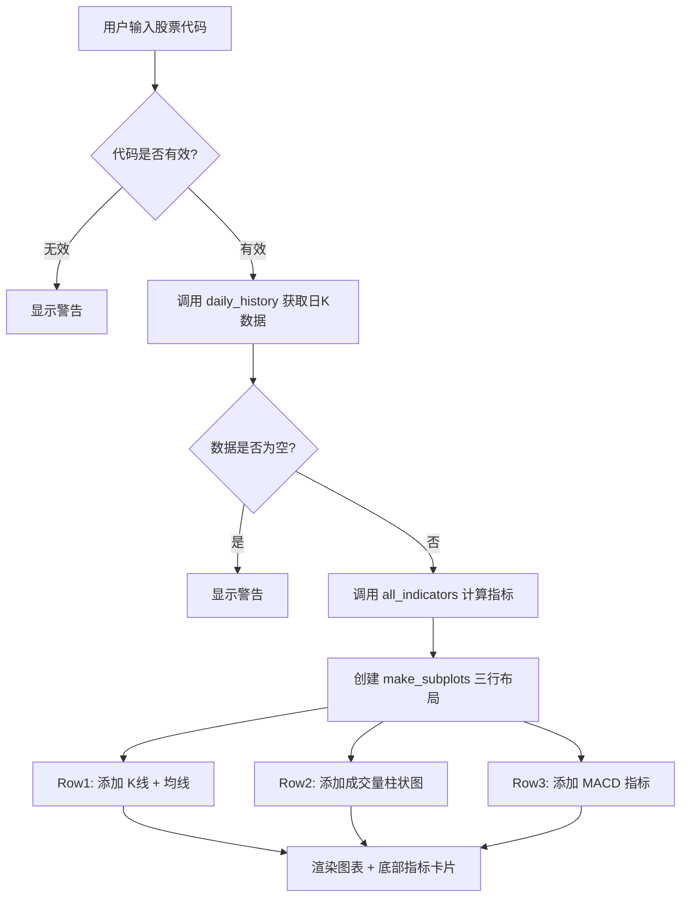

# 第6周：个股分析（K线可视化）

> 阶段：核心 | 难度：中级 | 核心文件：`dashboard/pages/03_个股分析.py`

## 本周目标

- 理解 K 线（蜡烛图）的构成和读图方法
- 掌握 Plotly 子图布局和蜡烛图绘制
- 能在个股分析页面添加新的指标子图

---

## K 线（蜡烛图）详解

### 基本构成

K 线（也称蜡烛图、Candlestick）是股票分析中最基础的价格可视化方式。每一根 K 线代表一个时间周期（本项目使用日 K 线）。

```
    │           │          │
    │    ╱│     │     ╱│   │
    │   ╱ │     │    ╱ │   │
    │  ╱  │     │   ╱  │   │      阳线（红）      阴线（绿）
    │ │实 │     │  │实 │   │      收 > 开          收 < 开
    │ │体 │     │  │体 │   │
    │  ╲  │     │   ╲  │   │
    │   ╲ │     │    ╲ │   │
    │    ╲│     │     ╲│   │
    │           │          │
  最高价       最低价       十字星
                   收 = 开
```

K 线四要素：

| 要素 | 含义 | 在图中的位置 |
|------|------|------------|
| **开盘价（Open）** | 当天第一笔成交价 | 实体底部（阳线）或顶部（阴线） |
| **收盘价（Close）** | 当天最后一笔成交价 | 实体顶部（阳线）或底部（阴线） |
| **最高价（High）** | 当天最高成交价 | 上影线顶端 |
| **最低价（Low）** | 当天最低成交价 | 下影线底端 |

### 上影线与下影线的含义

- **上影线长**：盘中冲高但回落，上方抛压重，看跌信号
- **下影线长**：盘中下跌但收回，下方支撑强，看涨信号
- **实体大**：多空一方明显占优，趋势延续性强
- **实体小**：多空力量接近，趋势不明朗

### 关键 K 线形态

| 形态 | 特征 | 信号含义 |
|------|------|---------|
| **十字星** | 开盘价 ≈ 收盘价，上下影线较长 | 趋势犹豫，可能变盘 |
| **锤子线** | 实体小，下影线长（≥实体2倍），上影线极短 | 下跌中出现 → 见底反转 |
| **吞没形态** | 今日实体完全包住昨日实体 | 阳包阴看涨，阴包阳看跌 |
| **大阳线** | 实体很长的阳线，涨幅 > 3% | 多头强势 |
| **大阴线** | 实体很长的阴线，跌幅 > 3% | 空头强势 |

### 中国惯例 vs 西方惯例

这是中国股民和国际惯例的一个重要区别：

| | 中国惯例 | 西方惯例 |
|---|---------|---------|
| **涨** | 红色 | 绿色 |
| **跌** | 绿色 | 红色 |

SmileX 项目使用中国惯例（红涨绿跌），代码中的配置：

```python
fig.add_trace(go.Candlestick(
    ...,
    increasing_line_color="red",    # 涨 = 红色
    decreasing_line_color="green",  # 跌 = 绿色
))
```

---

## 均线系统实战解读

均线（Moving Average, MA）是将一定周期内的收盘价取平均值连成的线。

### 均线周期含义

| 均线 | 周期 | 含义 | 实战用法 |
|------|------|------|---------|
| **MA5** | 5 个交易日（1周） | 超短期趋势 | 日内交易参考，价格在 MA5 附近波动 |
| **MA10** | 10 个交易日（2周） | 短期趋势 | 短线止盈止损参考 |
| **MA20** | 20 个交易日（1月） | 中期趋势 | 判断中期多空分界线 |
| **MA60** | 60 个交易日（1季） | 长期趋势 | 牛熊分界线，站上 MA60 视为中长期看多 |

### 多头排列 vs 空头排列

**多头排列**（看涨信号）：短期均线在上，长期均线在下

```
价格  ────────────────  (股价在所有均线上方)
MA5   ────────────────  (5日线)
MA10  ────────────────  (10日线)
MA20  ────────────────  (20日线)
MA60  ────────────────  (60日线)

所有均线向上发散，趋势强劲
```

**空头排列**（看跌信号）：短期均线在下，长期均线在上

```
MA60  ────────────────  (60日线)
MA20  ────────────────  (20日线)
MA10  ────────────────  (10日线)
MA5   ────────────────  (5日线)
价格  ────────────────  (股价在所有均线下方)

所有均线向下发散，趋势疲弱
```

### 金叉与死叉

**金叉**（看涨）：短期均线上穿长期均线。代码逻辑是：

```python
# 昨日 MA5 < MA10，今日 MA5 > MA10 → 金叉
df["ma5"].shift(1) < df["ma10"].shift(1) and df["ma5"] > df["ma10"]
```

**死叉**（看跌）：短期均线下穿长期均线。

---

## 代码精读：03_个股分析.py

### 整体结构

页面分为四个部分：输入区、K线图、指标子图、底部指标卡片。



### 数据获取

```python
code = st.text_input("输入股票代码", value="000001", max_chars=6)

if code:
    df = daily_history(code, start_date="20240101")  # 从2024年至今的日K线
    if df.empty:
        st.warning("未找到该股票数据")
    else:
        df = all_indicators(df)  # 计算全部技术指标
```

注意 `daily_history()` 默认使用前复权（`adjust="qfq"`），这在后续章节详细解释。

### 子图布局

```python
fig = make_subplots(
    rows=3, cols=1,              # 3行1列
    shared_xaxes=True,           # 共享X轴（日期联动）
    row_heights=[0.6, 0.2, 0.2], # 各行高度占比
    subplot_titles=["K线 + 均线", "成交量", "MACD"],
)
```

视觉布局如下：

```
┌──────────────────────────┐
│                          │
│   Row 1: K线 + 均线       │  60% 高度
│   (蜡烛图 + 4条均线)       │
│                          │
├──────────────────────────┤
│   Row 2: 成交量            │  20% 高度
│   (蓝色柱状图)             │
├──────────────────────────┤
│   Row 3: MACD             │  20% 高度
│   (DIF线 + DEA线 + 柱)    │
└──────────────────────────┘
```

`shared_xaxes=True` 的效果：当你在任意子图上缩放或平移时间范围，其他子图会同步联动。

### K 线图绑定

```python
fig.add_trace(go.Candlestick(
    x=df["date"],
    open=df["open"],     # 开盘价
    high=df["high"],     # 最高价
    low=df["low"],       # 最低价
    close=df["close"],   # 收盘价
    name="K线",
    increasing_line_color="red",    # 涨 → 红色（中国惯例）
    decreasing_line_color="green",  # 跌 → 绿色（中国惯例）
), row=1, col=1)
```

`go.Candlestick` 需要 4 个价格列。Plotly 会自动根据 open 和 close 的关系判断阳线或阴线。

### 均线叠加

```python
for col_name, color in [("ma5", "yellow"), ("ma10", "blue"),
                         ("ma20", "purple"), ("ma60", "gray")]:
    if col_name in df.columns:
        fig.add_trace(go.Scatter(
            x=df["date"], y=df[col_name],
            name=col_name.upper(),          # 图例显示 MA5, MA10...
            line=dict(color=color, width=1), # 细线，不喧宾夺主
        ), row=1, col=1)                    # 添加到第1行（K线图）
```

均线叠加在 K 线图上方，是"价格叠加型指标"的典型做法。

### 成交量子图

```python
fig.add_trace(go.Bar(
    x=df["date"], y=df["volume"],
    name="成交量",
    marker_color="rgba(100,100,200,0.5)",  # 半透明蓝色
), row=2, col=1)
```

成交量通常用柱状图展示，放在 K 线下方便于对比量价关系。

### MACD 子图

```python
if "macd_dif" in df.columns:
    fig.add_trace(go.Scatter(
        x=df["date"], y=df["macd_dif"], name="DIF",
        line=dict(color="blue", width=1),
    ), row=3, col=1)
    fig.add_trace(go.Scatter(
        x=df["date"], y=df["macd_dea"], name="DEA",
        line=dict(color="orange", width=1),
    ), row=3, col=1)
if "macd_hist" in df.columns:
    # MACD 柱状图：正值红色，负值绿色
    colors = ["red" if v >= 0 else "green" for v in df["macd_hist"].fillna(0)]
    fig.add_trace(go.Bar(
        x=df["date"], y=df["macd_hist"], name="MACD柱",
        marker_color=colors,
    ), row=3, col=1)
```

MACD 子图包含三个 trace：DIF 线、DEA 线、MACD 柱。柱状图的颜色根据正负值区分。

### 全局配置

```python
fig.update_layout(height=800, xaxis_rangeslider_visible=False)
for r in [1, 2, 3]:
    fig.update_xaxes(type="category", row=r, col=1)
```

- `height=800`：总高度 800 像素
- `xaxis_rangeslider_visible=False`：隐藏 Plotly 默认的范围滑块（占空间且不美观）
- `type="category"`：将 X 轴设为分类类型，避免日期间隔不均匀的问题

---

## Plotly 子图布局 API

### make_subplots 基础

```python
from plotly.subplots import make_subplots

# 创建 2 行 1 列的子图
fig = make_subplots(rows=2, cols=1)

# 添加 trace 到指定子图
fig.add_trace(go.Scatter(...), row=1, col=1)  # 第1行
fig.add_trace(go.Bar(...),     row=2, col=1)  # 第2行
```

### shared_xaxes 联动

```python
fig = make_subplots(
    rows=3, cols=1,
    shared_xaxes=True,   # X 轴联动：缩放一个，其他跟着动
)
```

### 自定义高度比例

```python
fig = make_subplots(
    rows=3, cols=1,
    row_heights=[0.6, 0.2, 0.2],  # 第1行占60%，第2行20%，第3行20%
)
```

### Candlestick 配置

```python
go.Candlestick(
    x=df["date"],
    open=df["open"], high=df["high"],
    low=df["low"], close=df["close"],
    increasing_line_color="red",      # 涨的线条颜色
    increasing_fillcolor="red",       # 涨的填充颜色
    decreasing_line_color="green",    # 跌的线条颜色
    decreasing_fillcolor="green",     # 跌的填充颜色
    name="K线",
)
```

### Bar 柱状图

```python
go.Bar(
    x=df["date"],
    y=df["volume"],
    marker_color="blue",              # 统一颜色
    # 或按条件着色：
    # marker_color=["red" if v > 0 else "green" for v in values]
)
```

---

## 前复权 vs 后复权 vs 不复权

这是股票数据中一个关键但容易混淆的概念。SmileX 项目默认使用前复权。

### 具体例子

假设一只股票的历史走势：

| 时间 | 不复权价格 | 事件 |
|------|-----------|------|
| 第1天 | 100 元 | 无 |
| 第2天 | 99 元 | 每10股派1元（每股除息0.1元） |
| 第3天 | 100 元 | 无 |

三种复权方式的处理：

**不复权**：真实交易价格，但存在"跳空"，无法直接对比

```
第1天: 100
第2天: 99    ← 除息导致的价格跳空
第3天: 100
```

**前复权（qfq，本项目使用）**：以最新价格为基准，调整历史价格

```
第1天: 99.9  ← 向下调整 0.1
第2天: 99
第3天: 100   ← 最新价不变
```

**后复权（hfq）**：以上市首日为基准，调整后续价格

```
第1天: 100
第2天: 100.1 ← 向上调整 0.1
第3天: 101.1
```

### 为什么用前复权？

- **技术分析**需要连续的价格曲线，不能有跳空缺口
- 前复权保证最新价格是真实的，历史价格被调整（方便看当前价位）
- 后复权保证上市首日价格不变，适合看长期累计涨幅

SmileX 项目在 `fetcher.py` 中的配置：

```python
def daily_history(code, start_date=DEFAULT_START_DATE, adjust="qfq"):
    # adjust="qfq" 就是前复权
```

---

## 实践练习

### 练习1：添加 RSI 子图

在现有三行布局基础上，增加第4行用于 RSI 指标：

```python
fig = make_subplots(
    rows=4, cols=1, shared_xaxes=True,
    row_heights=[0.5, 0.15, 0.15, 0.2],
    subplot_titles=["K线 + 均线", "成交量", "MACD", "RSI"],
)

# 添加 RSI 曲线
if "rsi14" in df.columns:
    fig.add_trace(go.Scatter(
        x=df["date"], y=df["rsi14"], name="RSI(14)",
        line=dict(color="purple", width=1),
    ), row=4, col=1)
    # 添加超买超卖参考线
    fig.add_hline(y=70, line_dash="dash", line_color="red", row=4, col=1)
    fig.add_hline(y=30, line_dash="dash", line_color="green", row=4, col=1)
```

### 练习2：添加布林带叠加

在 K 线图（Row 1）上叠加布林带三条线：

```python
for col_name, color in [("boll_upper", "gray"), ("boll_mid", "orange"), ("boll_lower", "gray")]:
    if col_name in df.columns:
        fig.add_trace(go.Scatter(
            x=df["date"], y=df[col_name], name=col_name,
            line=dict(color=color, width=1, dash="dash"),
        ), row=1, col=1)
```

### 练习3：修改 K 线配色方案

尝试使用不同的配色方案，比如深色主题：

```python
fig.add_trace(go.Candlestick(
    ...,
    increasing_line_color="#ff4444",    # 深红
    increasing_fillcolor="#ff6666",
    decreasing_line_color="#44ff44",    # 深绿
    decreasing_fillcolor="#66ff66",
))

fig.update_layout(
    plot_bgcolor="#1a1a2e",    # 深色背景
    paper_bgcolor="#16213e",
    font_color="white",
)
```

### 练习4：显示股票名称

在图表标题中显示股票名称而非代码。需要先查询股票信息：

```python
from smilex.fetcher import stock_info

if code:
    try:
        info = stock_info(code)
        stock_name = info[info["item"] == "股票简称"]["value"].values[0]
        st.subheader(f"{stock_name}（{code}）")
    except Exception:
        st.subheader(f"股票 {code}")
```

### 练习5：添加 KDJ 子图

在第4行（或替换现有布局）添加 KDJ 指标子图：

```python
if "kdj_k" in df.columns:
    fig.add_trace(go.Scatter(
        x=df["date"], y=df["kdj_k"], name="K",
        line=dict(color="blue", width=1),
    ), row=4, col=1)
    fig.add_trace(go.Scatter(
        x=df["date"], y=df["kdj_d"], name="D",
        line=dict(color="orange", width=1),
    ), row=4, col=1)
    fig.add_trace(go.Scatter(
        x=df["date"], y=df["kdj_j"], name="J",
        line=dict(color="purple", width=1),
    ), row=4, col=1)
    # 超买超卖线
    fig.add_hline(y=80, line_dash="dash", line_color="red", row=4, col=1)
    fig.add_hline(y=20, line_dash="dash", line_color="green", row=4, col=1)
```

---

## 自测清单

完成本周学习后，确认你能回答以下问题：

- [ ] 能说出 K 线四要素（开盘、收盘、最高、最低）在图中的位置
- [ ] 能区分中国惯例（红涨绿跌）和西方惯例，并解释项目中的配色选择
- [ ] 能解释 `make_subplots(rows=3, shared_xaxes=True, row_heights=[...])` 各参数含义
- [ ] 能说出前复权、后复权、不复权的区别，以及为什么技术分析用前复权
- [ ] 能独立在个股分析页面添加新的指标子图

---

## 学习资料

- 《日本蜡烛图技术》史蒂夫·尼森 - K 线分析经典著作
- [Plotly Candlestick 文档](https://plotly.com/python/candlestick-charts/) - 蜡烛图 API 详解
- [Plotly Subplots 指南](https://plotly.com/python/subplots/) - 子图布局 API
- B站搜索"K线入门 教程" - K 线基础视频
- B站搜索"均线系统 实战" - 均线实战解读
- B站搜索"MACD RSI 布林带 技术分析" - 技术指标综合讲解
