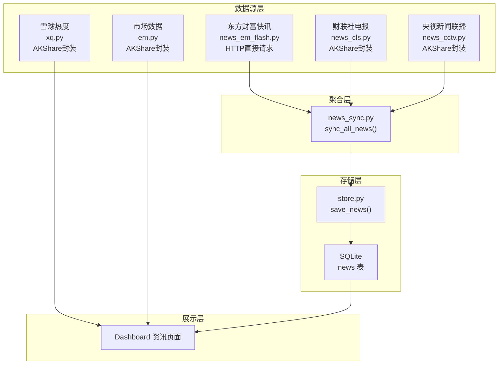

# 第8周：资讯聚合（多源数据）

> 阶段：核心 | 难度：中级 | 核心文件：`smilex/consult/`、`smilex/news_sync.py`

## 本周目标

- 理解多源数据聚合的架构设计思想
- 掌握两种数据获取模式：AKShare 封装 vs 直接 HTTP 请求
- 理解新闻去重和增量同步策略的实现方式
- 了解北向资金、龙虎榜、融资融券等核心市场概念及其数据来源

---

## 多源数据架构设计

本项目的资讯数据来自多个来源，通过统一的架构汇聚到一起：



设计思想：
- **统一接口**：所有新闻源模块都返回相同结构的 DataFrame（source, title, content, url, publish_time, fetch_time, extra）
- **编排层解耦**：`news_sync.py` 只负责调度各模块，不关心具体实现
- **存储层去重**：`store.py` 的 `save_news()` 通过 URL 唯一约束自动去重

---

## 两种数据获取模式

### 模式1：AKShare 封装

```python
# smilex/consult/news_cls.py — 通过 AKShare 获取财联社电报

import akshare as ak
import hashlib

def fetch_cls_telegraph():
    # 直接调用 AKShare 函数，获取已解析好的 DataFrame
    df = ak.stock_info_global_cls(symbol="全部")
    # 手动构造统一格式的输出
    for _, row in df.iterrows():
        url_hash = hashlib.md5((title + content).encode("utf-8")).hexdigest()
        rows.append({
            "source": "cls_telegraph",
            "title": str(row.get("标题", "")),
            "content": str(row.get("内容", "")),
            "url": f"cls://{url_hash}",           # 用 MD5 生成唯一标识
            "publish_time": f"{pub_date} {pub_time}",
            "fetch_time": now,
            "extra": json.dumps({"level": str(row.get("重要性", ""))}),
        })
```

特点：调用 `ak.*` 函数直接获取 DataFrame，无需处理 HTTP 请求细节。

### 模式2：直接 HTTP 请求

```python
# smilex/consult/news_em_flash.py — 直接请求东方财富 API

import requests

def fetch_em_flash(page_size=30):
    url = "https://np-listapi.eastmoney.com/comm/web/getNewsByColumns"
    params = {
        "client": "web", "biz": "web_news_col", "column": "350",
        "order": "1", "page_index": "1", "page_size": str(page_size),
    }
    headers = {
        "User-Agent": "Mozilla/5.0 ...",          # 伪装浏览器
        "Referer": "https://finance.eastmoney.com/",
    }
    resp = requests.get(url, params=params, headers=headers, timeout=10)
    data = resp.json()
    items = data.get("data", {}).get("list", [])   # 手动解析 JSON
    # ... 构造统一格式的 rows
```

特点：自己构造请求参数和请求头，手动解析 JSON 响应。适用于 AKShare 未封装的数据源。

### 对比：何时用哪种

| 对比维度 | AKShare 封装 | 直接 HTTP 请求 |
|---------|-------------|--------------|
| API 稳定性 | AKShare 维护接口，相对稳定 | 可能因目标网站改版而失效 |
| 数据解析 | 自动解析为 DataFrame | 需要手动提取 JSON 字段 |
| 请求控制 | 受 AKShare 限流约束 | 可自由设置 headers、timeout |
| 速度 | 较慢（AKShare 内部有延迟） | 较快（直接请求） |
| 适用场景 | 常见金融数据（行情、资金流等） | 自定义数据源、AKShare 未覆盖的 |

**决策原则**：AKShare 有封装的优先用 AKShare（稳定、省事）；没有封装的或需要更精细控制的，用直接 HTTP。

---

## 市场数据概念详解

### 北向资金（"聪明钱"）

**定义**：通过沪股通（上海）和深股通（深圳）从香港流入 A 股的外资。因为外资普遍被认为投资水平较高，所以被称为"聪明钱"。

**为什么重要**：北向资金经常领先于大盘走势。连续多日大额净流入通常预示市场上涨，大额净流出则需警惕。

**数据来源**（`em.py`）：

```python
def north_flow():
    """获取北向资金每日净流入"""
    return ak.stock_hsgt_north_net_flow_in_em().reset_index(drop=True)

def north_holdings():
    """获取北向资金重仓股排行"""
    return ak.stock_hsgt_hold_detail_em(market="北向").reset_index(drop=True)
```

**解读方法**：
- 连续 3 天以上净流入 + 累计超过 100 亿 → 偏多信号
- 单日净流出超过 80 亿 → 需要谨慎
- 重仓股变化 → 跟踪外资偏好板块

### 龙虎榜

**定义**：交易所每日公布的异动股票交易明细。当个股出现异常波动时，交易所会披露买卖金额最大的前 5 个营业部席位。

**上榜条件**：
- 主板：日涨跌幅偏离值达到 ±7%
- 创业板/科创板：日涨跌幅偏离值达到 ±15%
- 日换手率达到 20%

**数据来源**（`em.py`）：

```python
def dragon_tiger(date=""):
    """获取龙虎榜每日详情"""
    if not date:
        date = (datetime.now() - timedelta(days=1)).strftime("%Y%m%d")
    return ak.stock_lhb_detail_em(start_date=date, end_date=date)
```

**席位类型解读**：
- **机构专用**：基金、保险等正规机构，买入通常代表长线看好
- **游资营业部**：短线热钱，常见席位如"中信证券上海分公司"，擅长题材炒作
- 实战口诀：机构扎堆买入 > 游资接力 > 散户跟风

### 融资融券

**融资**：向券商借入资金买入股票（看涨）。融资余额增加 = 更多人在借钱买股票 = 看多情绪升温。

**融券**：向券商借入股票卖出（看跌）。融券余额增加 = 更多人在借股票卖空 = 看空情绪升温。

**数据来源**（`em.py`）：

```python
def margin_data():
    """获取融资融券数据"""
    d = (datetime.now() - timedelta(days=3)).strftime("%Y%m%d")  # 延迟3天（数据发布有滞后）
    return ak.stock_margin_sse(start_date=d, end_date=d)
```

**解读方法**：
- 融资余额持续上升 → 市场情绪偏多
- 融券余额急增 → 可能有大资金看空
- 融资融券余额比（融资/融券）可判断多空力量对比

### 雪球热度

雪球是国内最活跃的投资社区之一，热度排行反映了散户关注度：

```python
# smilex/consult/xq.py
def hot_stocks(rank_type="deal"):    # deal=成交排行, follow=关注排行, tweet=讨论排行
    if rank_type == "follow":
        df = ak.stock_hot_follow_xq()
    elif rank_type == "tweet":
        df = ak.stock_hot_tweet_xq()
    else:
        df = ak.stock_hot_deal_xq()
    return df
```

注意：社交媒体热度是反向指标——过于热门的股票往往已经过热，需谨慎追高。

---

## 代码精读：news_sync.py

```python
# smilex/news_sync.py — 新闻同步编排器

def sync_all_news():
    """调度器调用的新闻同步入口"""
    print(f"[{datetime.now()}] 新闻同步开始...")
    try:
        init_db()                           # 确保数据库表已创建

        # 第1步：东方财富快讯（每次都抓）
        df_em = fetch_em_flash()
        if not df_em.empty:
            save_news(df_em)                # save_news() 自动去重
            print(f"  东方财富快讯: {len(df_em)} 条")

        # 第2步：财联社电报（每次都抓）
        df_cls = fetch_cls_telegraph()
        if not df_cls.empty:
            save_news(df_cls)
            print(f"  财联社快讯: {len(df_cls)} 条")

        # 第3步：央视新闻（有频率限制，每6小时抓一次）
        if _should_fetch_cctv():            # 判断距上次抓取是否超过6小时
            df_cctv = fetch_cctv_news()
            if not df_cctv.empty:
                save_news(df_cctv)
                print(f"  新闻联播: {len(df_cctv)} 条")

        # 第4步：清理过期新闻（保留7天）
        cleanup_old_news(days=7)
        print(f"[{datetime.now()}] 新闻同步完成")
    except Exception as e:
        print(f"[{datetime.now()}] 新闻同步失败: {e}")
```

关键设计点：
1. **顺序获取**：三个数据源按顺序获取，不是并发。好处是简单可靠，坏处是总耗时 = 各源耗时之和。
2. **频率控制**：央视新闻通过 `_should_fetch_cctv()` 做了 6 小时间隔限制（内容更新频率低）。
3. **自动清理**：每次同步后清理 7 天前的旧新闻，防止数据库膨胀。
4. **错误隔离**：整个 `sync_all_news()` 被 try-except 包裹，任一源失败不影响其他源。

### _should_fetch_cctv() 频率控制

```python
def _should_fetch_cctv() -> bool:
    """央视新闻每6小时抓取一次即可"""
    existing = query_news(source="cctv_news", limit=1)  # 查最新一条
    if existing.empty:
        return True                                     # 没有历史记录，需要抓取
    last_fetch = existing.iloc[0].get("fetch_time", "")
    last_dt = datetime.strptime(last_fetch, "%Y-%m-%d %H:%M:%S")
    return (datetime.now() - last_dt).total_seconds() > 6 * 3600  # 超过6小时
```

---

## 新闻去重策略

### URL 作为唯一键

在 `store.py` 的 `init_db()` 中，news 表的 `url` 字段定义为 `UNIQUE`：

```sql
CREATE TABLE IF NOT EXISTS news (
    ...
    url TEXT UNIQUE NOT NULL,    -- URL 唯一约束
    ...
);
```

### INSERT OR IGNORE 幂等写入

`save_news()` 使用 `INSERT OR IGNORE` 语句，遇到重复 URL 自动跳过：

```python
def save_news(df):
    conn = _conn()
    save_df.to_sql("_tmp_news", conn, if_exists="replace", index=False)
    conn.execute(
        "INSERT OR IGNORE INTO news (source, title, content, url, ...) "
        "SELECT source, title, content, url, ... FROM _tmp_news"
    )
```

这与 Java 中 MyBatis 的 `INSERT ... ON DUPLICATE KEY UPDATE` 思路相同——先尝试插入，主键/唯一约束冲突则跳过（或更新）。

### 各数据源的 URL 构造方式

| 数据源 | URL 构造方式 | 去重依据 |
|-------|------------|---------|
| 东方财富快讯 | 直接使用新闻原始 URL | 新闻 URL 天然唯一 |
| 财联社电报 | `cls://` + MD5(title + content) | 标题+内容的哈希 |
| 央视新闻 | `cctv://` + 日期 + MD5(title + content[:200]) | 日期+标题+内容前200字的哈希 |

---

## 实践练习

### 练习1：对比两种数据获取模式

阅读 `news_em_flash.py`（HTTP直接请求）和 `news_cls.py`（AKShare封装）的完整代码，列出它们在以下方面的差异：引入库、请求方式、数据解析、错误处理。

### 练习2：追踪 sync_all_news 执行流程

在 `news_sync.py` 的 `sync_all_news()` 中添加更详细的日志，记录每个数据源的获取耗时。提示：在调用前后各记录一次时间，用 `time.time()` 计算差值。

### 练习3：创建新的新闻源模块

参考 `news_cls.py` 的结构，创建一个新的新闻获取模块（例如：新浪财经新闻）。需要：
1. 实现一个 `fetch_sina_news()` 函数
2. 返回统一格式的 DataFrame（source, title, content, url, publish_time, fetch_time, extra）
3. 在 `news_sync.py` 中添加调用

### 练习4：阅读 em.py 中的金融数据 API

打开 `smilex/consult/em.py`，逐个阅读 6 个函数（`capital_flow`, `market_fund_flow`, `north_flow`, `north_holdings`, `dragon_tiger`, `margin_data`），理解每个函数获取的是什么数据，以及为什么有些函数需要参数（如 `code`）而有些不需要。

### 练习5：实现频率控制

参考 `_should_fetch_cctv()` 的实现，为东方财富快讯也实现一个频率控制：如果距上次获取不到 60 秒，则跳过。思考：这种控制对快速更新的数据源是否合理？

---

## 自测清单

- [ ] 能画出从新闻源到 Dashboard 展示的完整数据流
- [ ] 能说出 AKShare 封装和直接 HTTP 请求各自的优缺点
- [ ] 能解释新闻去重的实现原理（UNIQUE 约束 + INSERT OR IGNORE）
- [ ] 能说出北向资金、龙虎榜、融资融券分别代表什么市场信号
- [ ] 能理解 `_should_fetch_cctv()` 的频率控制逻辑

---

## 学习资料

### AKShare 官方资源
- [AKShare 数据字典](https://akshare.akfamily.xyz/data/index.html) — 所有可用数据接口索引
- AKShare GitHub 仓库 — 查看每个函数的参数说明和示例

### 中文教程
- CSDN AKShare 系列教程 — 搜索"AKShare 入门教程"
- AKShare vs Tushare 对比文章 — 搜索"AKShare Tushare 对比"
- 东方财富 API 抓取教程 — 搜索"东方财富 API python"

### 市场概念入门
- 北向资金基础解读 — 搜索"北向资金 看盘入门"
- 龙虎榜看盘技巧 — 搜索"龙虎榜 分析方法"
- 融资融券入门指南 — 搜索"融资融券 新手入门"
