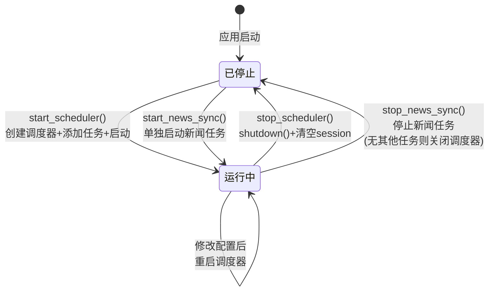

# 第9周：任务调度 + 系统设置

> 阶段：进阶 | 难度：中级 | 核心文件：`smilex/scheduler.py`、`dashboard/pages/06_系统设置.py`

## 本周目标

- 理解 APScheduler 的架构和核心组件（调度器、触发器、任务存储）
- 掌握 cron 和 interval 两种触发器的使用场景和配置方式
- 理解 Streamlit session_state 的工作原理及其与调度器的配合方式
- 能在 Dashboard 系统设置页面中自定义定时任务和配置管理

---

## APScheduler 架构

### APScheduler vs Quartz（Java）对照表

如果你做过 Java 开发，很可能接触过 Quartz 调度框架。以下是两者的对比：

| 对比维度 | APScheduler (Python) | Quartz (Java) |
|---------|---------------------|---------------|
| 调度器类型 | `BackgroundScheduler`（线程）<br/>`AsyncIOScheduler`（协程） | `StdScheduler`（线程池） |
| cron 语法 | `hour=15, minute=30`（关键字参数） | `"0 30 15 * * ?"`（cron 表达式字符串） |
| interval 语法 | `seconds=30`（关键字参数） | `SimpleScheduleBuilder.repeatForever().withIntervalInSeconds(30)` |
| 持久化 | 默认内存，可配 MongoDB/SQLAlchemy | 默认内存，支持 JDBC JobStore |
| 集群 | 不支持（单进程） | 支持（通过数据库锁） |
| 使用场景 | 单机应用、轻量级调度 | 企业级分布式调度 |
| 依赖 | `pip install apscheduler` | Spring Boot Starter 自带 |

### 三大核心组件

**1. Scheduler（调度器）** — 总控制器

```python
from apscheduler.schedulers.background import BackgroundScheduler
scheduler = BackgroundScheduler()  # 在后台线程中运行
scheduler.start()                   # 启动调度器
```

本项目使用 `BackgroundScheduler`，它在一个独立的后台线程中运行所有任务，不会阻塞主线程。适合 Streamlit 这种 Web 应用场景。

**2. Trigger（触发器）** — 决定"什么时候执行"

| 触发器类型 | 用途 | 示例 |
|-----------|------|------|
| `cron` | 定时执行（类似 cron 表达式） | 每天下午 3:30 执行 |
| `interval` | 固定间隔执行 | 每 30 秒执行一次 |
| `date` | 一次性执行（指定日期时间） | 2025-01-01 00:00:00 执行一次 |

**3. JobStore（任务存储）** — 保存任务信息

默认使用内存存储（`MemoryJobStore`），进程退出后任务信息丢失。本项目通过 JSON 文件持久化配置信息来弥补这一点。

---

## 代码精读：scheduler.py

### start_scheduler()

```python
def start_scheduler(st_state, hour, minute):
    # 第1步：如果已有调度器在运行，先关闭
    scheduler = st_state.get("_scheduler")
    if scheduler and scheduler.running:
        scheduler.shutdown(wait=False)

    # 第2步：创建新的后台调度器
    scheduler = BackgroundScheduler()

    # 第3步：添加每日选股任务（cron 触发器）
    scheduler.add_job(
        run_daily_job,                  # 要执行的函数
        "cron",                         # 触发器类型
        hour=hour, minute=minute,       # 每天 hour:minute 执行
        id="daily_scan",                # 任务唯一ID
        replace_existing=True,          # 如果已存在则替换
    )

    # 第4步：添加大盘同步任务（interval 触发器）
    if cfg.get("market_sync_enabled"):
        interval = cfg.get("market_sync_interval", 60)
        scheduler.add_job(
            sync_market_overview,
            "interval",                 # 触发器类型
            seconds=interval,           # 每 interval 秒执行
            id="market_sync",
            replace_existing=True,
        )

    # 第5步：添加新闻同步任务（interval 触发器）
    if cfg.get("news_sync_enabled"):
        from smilex.news_sync import sync_all_news
        interval = cfg.get("news_sync_interval", 30)
        scheduler.add_job(
            sync_all_news,
            "interval",
            seconds=interval,
            id="news_sync",
            replace_existing=True,
        )

    # 第6步：启动并保存到 session_state
    scheduler.start()
    st_state["_scheduler"] = scheduler      # 关键：保存到 Streamlit session
```

### 三个独立任务设计

| 任务名称 | 触发器 | 间隔 | 调用函数 | 用途 |
|---------|--------|------|---------|------|
| 每日选股 | cron | 每天 15:30 | `run_daily_job()` | 收盘后自动更新数据并选股 |
| 新闻同步 | interval | 每 30 秒 | `sync_all_news()` | 持续获取最新财经新闻 |
| 大盘同步 | interval | 每 60 秒 | `sync_market_overview()` | 实时更新大盘涨跌统计 |

### run_daily_job() 详解

```python
def run_daily_job():
    """执行每日收盘后任务"""
    # 第1步：初始化数据库
    init_db()

    # 第2步：更新股票列表
    stocks = stock_list()                    # 从 AKShare 获取全部 A 股列表
    save_stock_list(stocks)                  # 保存到 SQLite

    # 第3步：更新日K数据（取前300只）
    codes = stocks["code"].head(300).tolist()
    update_daily(codes)                      # 增量更新每只股票的日K线

    # 第4步：执行选股扫描
    results = daily_scan()                   # 运行技术指标筛选

    # 第5步：保存扫描结果
    filepath = os.path.join(HISTORY_DIR, f"scan_{datetime.now().strftime('%Y%m%d')}.csv")
    results.to_csv(filepath, index=False, encoding="utf-8-sig")

    # 第6步：推送通知
    push_scan(results)                       # 通过 Bark/微信推送选股结果
```

### 配置管理

```python
CONFIG_FILE = os.path.join(HISTORY_DIR, "scheduler_config.json")

def load_config() -> dict:
    """从 JSON 文件加载配置，不存在则返回默认值"""
    if os.path.exists(CONFIG_FILE):
        with open(CONFIG_FILE, "r", encoding="utf-8") as f:
            return json.load(f)
    return {
        "enabled": False,                    # 调度器是否启用
        "hour": 15,                          # 每日扫描时间（时）
        "minute": 30,                        # 每日扫描时间（分）
        "news_sync_enabled": False,          # 新闻同步是否启用
        "news_sync_interval": 30,            # 新闻同步间隔（秒）
        "market_sync_enabled": False,        # 大盘同步是否启用
        "market_sync_interval": 60,          # 大盘同步间隔（秒）
    }

def save_config(cfg: dict):
    """保存配置到 JSON 文件"""
    os.makedirs(HISTORY_DIR, exist_ok=True)
    with open(CONFIG_FILE, "w", encoding="utf-8") as f:
        json.dump(cfg, f, ensure_ascii=False, indent=2)
```

### 启动/停止生命周期



---

## Streamlit session_state 原理

### Rerun 模型

Streamlit 的执行模型与普通 Python 脚本完全不同——**每次用户交互都会从头重新执行整个脚本**：

```
用户点击按钮 → 脚本从头执行 → 渲染新页面 → 等待下次交互 → ...
```

这意味着：如果你在脚本中创建了一个调度器对象，用户每次点击按钮后，这个对象就会被销毁并重新创建。这就是为什么需要 `session_state`。

### session_state 的作用

`st.session_state` 是一个类似字典的对象，**在多次 rerun 之间持久保存数据**：

```python
# 第一次执行
st.session_state["_scheduler"] = scheduler   # 保存调度器实例

# 用户点击按钮后，脚本重新执行
scheduler = st.session_state.get("_scheduler")  # 取回之前保存的调度器
if scheduler and scheduler.running:
    # 调度器还在后台运行！
```

### Java 类比

| 概念 | Java (Spring) | Streamlit |
|------|--------------|-----------|
| 请求作用域 | `@RequestScope` | 脚本的一次执行 |
| 会话作用域 | `@SessionScope` | `st.session_state` |
| 单例 | `@Singleton` | Python 模块级变量 |
| 上下文 | `ApplicationContext` | `st.session_state`（兼任） |

### 关键模式：`st.session_state["_scheduler"]`

本项目将 APScheduler 的 `BackgroundScheduler` 实例保存在 `st.session_state["_scheduler"]` 中：

- **存入时机**：`start_scheduler()` 中 `st_state["_scheduler"] = scheduler`
- **取出时机**：每次需要检查调度器状态时 `st.session_state.get("_scheduler")`
- **清除时机**：`stop_scheduler()` 中 `st_state["_scheduler"] = None`

注意：`st_state` 参数就是 `st.session_state` 的引用。调用时写法为 `start_scheduler(st.session_state, hour, minute)`。这种将 session_state 作为参数传入的设计使得函数更容易测试。

---

## 代码精读：06_系统设置.py

### UI 布局结构

```
系统设置
├── 定时任务
│   ├── 扫描时间设置（时/分 number_input）
│   ├── 启动/停止/立即执行 按钮
│   └── 运行状态显示
├── 新闻同步
│   ├── 同步间隔设置（秒 number_input）
│   ├── 启动/停止/立即同步 按钮
│   └── 运行状态显示
├── 大盘同步
│   ├── 同步间隔设置（秒 number_input）
│   ├── 启动/停止/立即同步 按钮
│   └── 运行状态显示
├── 运行状态
│   └── 调度器状态 + 下次执行时间
├── 扫描历史
│   └── CSV 文件选择 + 数据展示 + 下载
└── 通知记录
    └── 最近 20 条通知日志
```

### UI 与 Scheduler 的映射关系

```python
# 按钮状态根据调度器运行状态动态变化
is_running = (
    st.session_state.get("_scheduler") is not None
    and st.session_state["_scheduler"].running
)

# 启动按钮：调度器未运行时可点击
if st.button("启动定时任务", type="primary", disabled=is_running):
    start_scheduler(st.session_state, scan_hour, scan_minute)
    st.rerun()        # 重要：启动后强制重新执行脚本以刷新UI状态

# 停止按钮：调度器运行中时可点击
if st.button("停止定时任务", disabled=not is_running):
    stop_scheduler(st.session_state)
    st.rerun()
```

关键理解点：
- **`disabled` 参数**：根据当前状态控制按钮是否可点击。`disabled=is_running` 表示"运行中时启动按钮不可点击"。
- **`st.rerun()`**：操作完成后强制刷新页面，确保 UI 状态与后台状态同步。
- **三段式布局**：每个功能模块都是"启动按钮 + 停止按钮 + 手动执行按钮"的三列布局（`st.columns(3)`）。

### 配置读取与持久化

```python
# 每次页面加载时读取配置
cfg = load_config()

# number_input 用配置值作为默认值
scan_hour = st.number_input("扫描时间（时）", value=cfg.get("hour", 15))

# 启动时保存新配置
start_scheduler(st.session_state, scan_hour, scan_minute)
# 内部会调用 save_config() 持久化
```

---

## 实践练习

### 练习1：读懂 UI → Scheduler 映射关系

打开 `dashboard/pages/06_系统设置.py`，追踪"启动定时任务"按钮被点击后的完整调用链：按钮点击 → `start_scheduler()` → `scheduler.add_job()` → `scheduler.start()` → `save_config()` → `st.rerun()`。在代码中标注每一步。

### 练习2：追踪 start_scheduler 执行流程

在 `scheduler.py` 的 `start_scheduler()` 函数中添加 print 日志，记录：调度器创建、每个任务的添加、调度器启动。然后通过 Dashboard 启动定时任务，观察控制台输出。

### 练习3：添加多个每日扫描时间

当前 `start_scheduler()` 只支持一个每日扫描时间。尝试修改为支持多个扫描时间（例如 11:00 和 15:30 各执行一次）。提示：可以为每个时间创建一个独立的 job，id 分别为 `"daily_scan_1"` 和 `"daily_scan_2"`。

### 练习4：添加任务暂停/恢复功能

当前只有启动和停止。尝试为每个任务添加"暂停"和"恢复"功能：

```python
def pause_job(st_state, job_id: str):
    scheduler = st_state.get("_scheduler")
    if scheduler and scheduler.running:
        scheduler.pause_job(job_id)     # 暂停但不删除

def resume_job(st_state, job_id: str):
    scheduler = st_state.get("_scheduler")
    if scheduler and scheduler.running:
        scheduler.resume_job(job_id)    # 从暂停中恢复
```

思考：暂停和停止在用户体验上有什么区别？

### 练习5：对比 APScheduler 与 Quartz

如果你有 Java 经验，写一个对比表：分别在 APScheduler 和 Quartz 中实现"每天 15:30 执行一次任务"的代码。对比两者的：配置方式、错误处理、持久化方案、集群支持。

---

## 自测清单

- [ ] 能说出 APScheduler 的三大核心组件及其职责
- [ ] 能解释 cron 和 interval 两种触发器的区别及各自的使用场景
- [ ] 能解释为什么需要 `st.session_state` 来保存调度器实例
- [ ] 能追踪从 Dashboard 按钮点击到任务执行的完整调用链
- [ ] 能说出 `load_config()` / `save_config()` 的配置文件格式和存储位置

---

## 学习资料

### APScheduler 官方文档
- [APScheduler User Guide](https://apscheduler.readthedocs.io/en/master/userguide.html) — 完整使用指南
- [CronTrigger API](https://apscheduler.readthedocs.io/en/master/modules/triggers/cron.html) — cron 触发器参数详解
- [IntervalTrigger API](https://apscheduler.readthedocs.io/en/master/modules/triggers/interval.html) — interval 触发器参数详解

### 教程文章
- [Better Stack: APScheduler Guide](https://betterstack.com/community/guide/getting-started-with-apscheduler/) — 英文入门教程
- CSDN APScheduler 系列 — 搜索"APScheduler 教程 Python"

### Streamlit 相关
- [Streamlit session_state 官方文档](https://docs.streamlit.io/library/api-reference/session-state) — session_state API 参考
- Streamlit Callback 机制 — 理解 on_change、on_click 等回调

### Quartz 对比（Java 开发者）
- Quartz Scheduler 官方文档 — 对照理解两者设计异同
- Spring Boot + Quartz 集成教程 — 回顾 Java 中的调度实现方式
