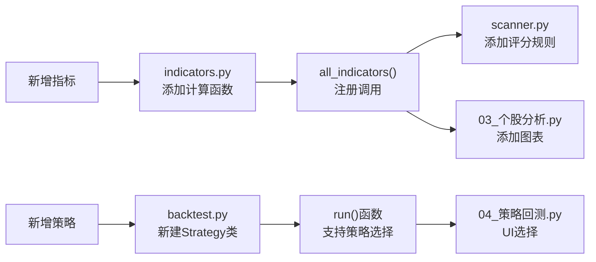

# 第11周：功能扩展（新指标 + 新策略）

> 阶段：进阶 | 难度：进阶 | 核心文件：`smilex/indicators.py`、`smilex/backtest.py`
>
> 前置知识：完成第 3 周（技术指标）和第 7 周（策略回测）

## 本周目标

- 实现新指标 ATR（真实波动幅度）并集成到项目中
- 实现 RSI 均值回归策略并通过回测验证
- 为 scanner.py 添加 KDJ 评分规则
- 掌握扩展指标和策略的标准模式

## 扩展模式总览



## 新增指标：ATR（真实波动幅度）

### ATR 原理

- **全称**：Average True Range（平均真实波幅）
- **类型**：波动率指标
- **用途**：衡量市场波动程度，常用于设置止损位和仓位管理
- **公式**：
  ```
  TR = max(当日最高-当日最低, |当日最高-昨日收盘|, |当日最低-昨日收盘|)
  ATR = TR 的 N 日移动平均（默认 14）
  ```
- **解读**：ATR 越高，市场波动越大；ATR 越低，市场越平静

### 实现步骤

**Step 1：在 `indicators.py` 中添加函数**

```python
def atr(df: pd.DataFrame, period: int = 14) -> pd.DataFrame:
    """真实波动幅度（ATR）"""
    high_low = df["high"] - df["low"]
    high_close = (df["high"] - df["close"].shift(1)).abs()
    low_close = (df["low"] - df["close"].shift(1)).abs()

    tr = pd.concat([high_low, high_close, low_close], axis=1).max(axis=1)
    df["atr"] = tr.rolling(window=period).mean()
    return df
```

**Step 2：在 `all_indicators()` 中注册**

```python
def all_indicators(df: pd.DataFrame) -> pd.DataFrame:
    df = ma(df)
    df = macd(df)
    df = rsi(df)
    df = bollinger(df)
    df = kdj(df)
    df = volume_ratio(df)
    df = atr(df)        # ← 新增
    return df
```

**Step 3：在 config.py 中添加配置**

```python
ATR_PERIOD = 14
```

**Step 4：在个股分析页面添加 ATR 子图**（可选，作为练习）

### 验证

```python
# 在 Python 中快速验证
from smilex.fetcher import daily_history
from smilex.indicators import all_indicators

df = daily_history("000001", start_date="20250101")
df = all_indicators(df)
print(df[["date", "close", "atr"]].tail(10))
```

## 新增策略：RSI 均值回归

### 策略原理

- **核心思想**：RSI 超卖时买入，超买时卖出
- **买入条件**：RSI < 30（超卖，价格可能反弹）
- **卖出条件**：RSI > 70（超买，价格可能回调）
- **与双均线策略对比**：

| 特性 | 双均线交叉 | RSI 均值回归 |
|------|-----------|-------------|
| 市场环境 | 趋势市 | 震荡市 |
| 信号频率 | 较低 | 较高 |
| 持仓时间 | 较长 | 较短 |
| 假信号 | 横盘市多 | 趋势市多 |

### 实现步骤

**Step 1：在 `backtest.py` 中新建策略类**

```python
class RSIStrategy(bt.Strategy):
    params = (
        ("rsi_period", 14),
        ("oversold", 30),
        ("overbought", 70),
    )

    def __init__(self):
        self.rsi = bt.indicators.RSI(self.data.close, period=self.p.rsi_period)
        self.trades: list[dict] = []

    def next(self):
        if self.rsi < self.p.oversold:
            if not self.position:
                size = int(self.broker.getcash() / self.data.close[0] / 100) * 100
                if size > 0:
                    self.buy(size=size)
                    self.trades.append({
                        "type": "BUY",
                        "date": self.data.datetime.date(0),
                        "price": self.data.close[0],
                        "size": size,
                        "reason": f"RSI={self.rsi[0]:.1f}<{self.p.oversold}",
                    })
        elif self.rsi > self.p.overbought:
            if self.position:
                self.close()
                self.trades.append({
                    "type": "SELL",
                    "date": self.data.datetime.date(0),
                    "price": self.data.close[0],
                    "size": self.position.size,
                    "reason": f"RSI={self.rsi[0]:.1f}>{self.p.overbought}",
                })
```

**Step 2：修改 `run()` 支持策略选择**

```python
def run(df, strategy="ma", **kwargs):
    cerebro = bt.Cerebro()
    if strategy == "ma":
        cerebro.addstrategy(MAStrategy, **kwargs)
    elif strategy == "rsi":
        cerebro.addstrategy(RSIStrategy, **kwargs)
    # ... 其余逻辑不变
```

**Step 3：在策略回测页面添加策略选择 UI**

```python
strategy = st.selectbox("选择策略", ["双均线交叉", "RSI均值回归"])
```

### 回测验证

```python
from smilex.fetcher import daily_history
from smilex.backtest import run

df = daily_history("000001", start_date="20220101")
result_ma = run(df, strategy="ma")
result_rsi = run(df, strategy="rsi")

print(f"双均线: 年化{result_ma['annual_return']}%, 回撤{result_ma['max_drawdown']}%")
print(f"RSI:    年化{result_rsi['annual_return']}%, 回撤{result_rsi['max_drawdown']}%")
```

## 扩展 scanner.py：添加 KDJ 评分

### 设计思路

KDJ 金叉（K 上穿 D）是短期转折信号，可作为辅助评分条件：

```python
# 在 _evaluate() 中新增
k = latest.get("kdj_k")
d = latest.get("kdj_d")
j = latest.get("kdj_j")

if all(pd.notna([k, d, j])):
    if k > d and 20 < k < 80:      # KDJ 金叉且在中间区域
        score += 10
        reasons.append("KDJ金叉")
    elif j > 100:                    # J 值过高，超买
        score -= 5                   # 扣分
        reasons.append("KDJ超买")
```

### 调整评分权重

添加 KDJ 后需要重新分配 100 分：

| 条件 | 调整前 | 调整后 |
|------|--------|--------|
| 均线多头排列 | 30 | 25 |
| MACD 金叉 | 20 | 20 |
| 量比 > 1.5 | 20 | 20 |
| 布林中轨上方 | 15 | 15 |
| RSI 适中 | 15 | 10 |
| KDJ 金叉 | — | 10 |
| **合计** | **100** | **100** |

### 验证

运行扫描并对比添加 KDJ 前后的推荐列表差异。

## 更多扩展方向

### 指标扩展

| 指标 | 类型 | 实现难度 | pandas-ta 函数 |
|------|------|---------|---------------|
| ATR | 波动率 | 简单 | `ta.atr()` |
| OBV | 成交量 | 简单 | `ta.obv()` |
| CCI | 动量 | 中等 | `ta.cci()` |
| ADX | 趋势 | 中等 | `ta.adx()` |
| Ichimoku | 综合 | 较难 | `ta.ichimoku()` |

### 策略扩展

| 策略 | 类型 | 市场环境 | 实现难度 |
|------|------|---------|---------|
| RSI 均值回归 | 均值回归 | 震荡市 | 简单 |
| 布林带突破 | 突破 | 趋势市 | 简单 |
| MACD 背离 | 反转 | 趋势末期 | 中等 |
| 多时间框架 | 综合 | 通用 | 较难 |
| 机器学习因子 | ML | 通用 | 高级 |

## 实践练习

1. **实现 ATR 指标**：按步骤在 `indicators.py` 中添加 `atr()` 函数，注册到 `all_indicators()`，验证输出
2. **实现 RSI 策略**：在 `backtest.py` 中新建 `RSIStrategy` 类，用 2 只不同股票回测
3. **对比回测结果**：用同一只股票分别运行双均线和 RSI 策略，对比年化收益率和最大回撤
4. **添加 KDJ 评分**：修改 `_evaluate()` 添加 KDJ 评分规则，调整权重，运行扫描对比
5. **添加止损规则**：在 `MAStrategy` 中添加 5% 止损逻辑，观察对回测结果的影响

## 自测清单

- [ ] 能在 `indicators.py` 中添加新指标函数并注册到 `all_indicators()`
- [ ] 能在 `backtest.py` 中新建 Strategy 类并完成回测
- [ ] 能修改 scanner.py 的评分权重并保持总分 100
- [ ] 能对比不同策略的回测结果并分析优劣
- [ ] 能设计止损规则并理解其对回测的影响

## 学习资料

- [pandas-ta GitHub（推荐分支）](https://github.com/xgboosted/pandas-ta-classic) — 192 个指标实现参考
- [pandas-ta ReadTheDocs](https://technical-analysis-library-in-python.readthedocs.io/) — API 文档
- [Backtrader 策略开发指南](https://www.backtrader.com/docu/strategy/) — Strategy 类参考
- [Backtrader 指标使用指南](https://www.backtrader.com/docu/induse/) — 122 个内置指标
- [BigQuant 量化策略指标解析](https://bigquant.com/wiki/doc/C54hzJxRqd) — 含代码的指标应用
- [JoinQuant 机器学习多因子策略](https://www.joinquant.com/post/63110) — 进阶方向
