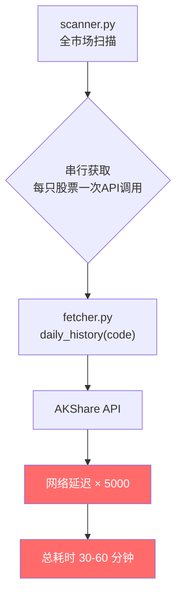
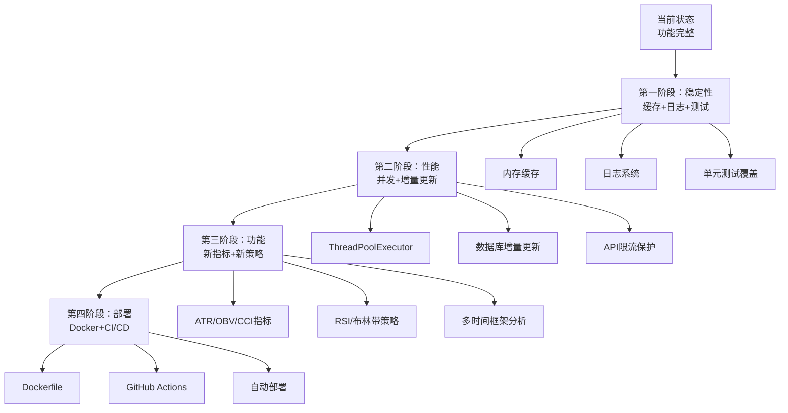

# 第12周：架构优化

> 阶段：进阶 | 难度：进阶 | 核心范围：全局架构
>
> 前置知识：完成前 11 周学习，理解所有模块的实现细节

## 本周目标

- 优化 API 调用性能（缓存、并发）
- 改进错误处理和日志记录
- 理解异步数据获取的设计思路
- 建立完整的项目改进路线图

## 当前架构分析

### 数据流瓶颈



**核心问题**：`daily_scan()` 串行遍历全市场约 5000 只股票，每只都调用一次 API，耗时极长。

### 优化方向总览

| 优化方向 | 预期收益 | 实现难度 | 风险 |
|---------|---------|---------|------|
| 内存缓存 | 减少 80% 重复 API 调用 | 低 | 低 |
| 数据库缓存 | 避免重复下载历史数据 | 低 | 低 |
| 并发请求 | 扫描速度提升 5-10 倍 | 中 | 中（限流风险）|
| 异步 I/O | 进一步提升并发效率 | 高 | 中 |
| 增量更新 | 只下载新数据 | 低 | 低 |

## 优化1：内存缓存

### 原理

使用 Python 装饰器 `@cache` 或 `@lru_cache` 缓存函数返回值，避免重复 API 调用。

### 实现

```python
# smilex/cache.py（新文件）
from functools import lru_cache
from datetime import datetime, date

# 按日期缓存：同一天内不重复请求
_stock_list_cache = {"date": None, "data": None}

def cached_stock_list():
    """带日期缓存的股票列表"""
    today = date.today()
    if _stock_list_cache["date"] != today:
        from smilex.fetcher import stock_list
        _stock_list_cache["date"] = today
        _stock_list_cache["data"] = stock_list()
    return _stock_list_cache["data"]
```

### 注意事项

- 缓存应有 TTL（过期时间），股票列表可缓存 1 天，实时行情不宜缓存
- `lru_cache` 不适合 DataFrame（内存占用大），适合小量数据
- 分布式环境下需用 Redis 等外部缓存

## 优化2：数据库缓存（增量更新）

### 原理

`store.py` 已有 `update_daily()` 实现增量更新，但 `scanner.py` 的 `daily_scan()` 未利用它。

### 改进思路

```python
# 改进前：扫描时逐个获取
def daily_scan():
    stocks = stock_list()
    for row in stocks.iterrows():
        df = daily_history(code)  # 每次都从API获取
        df = all_indicators(df)
        ...

# 改进后：先批量更新数据库，再从数据库查询
def daily_scan():
    stocks = stock_list()
    save_stock_list(stocks)
    update_daily(stocks["code"].tolist())  # 批量增量更新

    for row in stocks.iterrows():
        df = query_daily(code)  # 从本地SQLite读取
        if len(df) < 60:
            continue
        df = all_indicators(df)
        ...
```

### 收益

- 增量更新只下载新数据，大幅减少 API 调用量
- 本地 SQLite 查询速度远快于网络请求
- 数据持久化，重启后无需重新下载

## 优化3：并发请求

### 原理

使用 `concurrent.futures.ThreadPoolExecutor` 并发获取数据。

### 实现

```python
from concurrent.futures import ThreadPoolExecutor, as_completed

def _fetch_and_evaluate(row):
    """获取单只股票数据并评分"""
    code = row["code"]
    name = row["name"]
    try:
        start = (datetime.now() - timedelta(days=180)).strftime("%Y%m%d")
        df = daily_history(code, start_date=start)
        if len(df) < 60:
            return None
        df = all_indicators(df)
        score, reasons = _evaluate(df.iloc[-1])
        if score > 0:
            return {
                "code": code, "name": name,
                "price": round(df.iloc[-1]["close"], 2),
                "score": score, "reasons": "；".join(reasons),
            }
    except Exception:
        return None
    return None

def daily_scan():
    stocks = stock_list()
    stocks = stocks[~stocks.apply(_should_skip, axis=1)]

    results = []
    with ThreadPoolExecutor(max_workers=10) as executor:
        futures = {executor.submit(_fetch_and_evaluate, row): i
                   for i, row in stocks.iterrows()}
        for future in as_completed(futures):
            result = future.result()
            if result:
                results.append(result)

    if results:
        return pd.DataFrame(results).sort_values("score", ascending=False)
    return pd.DataFrame()
```

### 注意事项

- `max_workers` 不宜过大（建议 5-10），否则可能被 API 限流
- 需要处理线程安全（pandas 操作一般是线程安全的）
- 建议添加 rate limiting：每秒最多 N 次请求

## 优化4：错误处理改进

### 当前问题

```python
# scanner.py 现状：静默忽略所有异常
try:
    df = daily_history(code, start_date=start)
except Exception:
    continue  # 不知道为什么失败
```

### 改进方案

```python
import logging

logger = logging.getLogger(__name__)

def daily_scan():
    ...
    try:
        df = daily_history(code, start_date=start)
    except ConnectionError:
        logger.warning(f"网络错误: {code}")
        continue
    except ValueError as e:
        logger.error(f"数据异常: {code} - {e}")
        continue
    except Exception as e:
        logger.exception(f"未知错误: {code}")
        continue
```

### 日志配置

```python
# 在 main.py 或 scheduler.py 中配置
import logging

logging.basicConfig(
    level=logging.INFO,
    format="%(asctime)s [%(levelname)s] %(name)s: %(message)s",
    handlers=[
        logging.FileHandler("data/smilex.log", encoding="utf-8"),
        logging.StreamHandler(),
    ]
)
```

## 优化5：配置外部化

### 当前问题

`config.py` 中所有参数都是硬编码常量，修改需要改代码。

### 改进方案

支持环境变量覆盖：

```python
import os

DEFAULT_START_DATE = os.getenv("SMILEX_START_DATE", "20210101")
INITIAL_CAPITAL = float(os.getenv("SMILEX_CAPITAL", "100000"))
DASHBOARD_PORT = int(os.getenv("SMILEX_PORT", "8501"))
```

或支持 YAML/JSON 配置文件：

```python
import json

def load_app_config():
    config_path = os.path.join(BASE_DIR, "config.json")
    if os.path.exists(config_path):
        with open(config_path) as f:
            return json.load(f)
    return {}
```

## 项目改进路线图



## 进阶方向

### 数据层进阶

| 方向 | 说明 | 技术栈 |
|------|------|--------|
| 实时行情推送 | WebSocket 接入实时数据 | websockets / Socket.IO |
| 分钟级 K 线 | 更细粒度的行情分析 | AKShare 分钟线接口 |
| 基本面数据 | PE/PB/ROE 等财务指标 | AKShare 财务数据 |
| 另类数据 | 社交情绪、新闻情感分析 | NLP / LLM |

### 策略层进阶

| 方向 | 说明 | 技术栈 |
|------|------|--------|
| 多时间框架 | 日线+周线+月线联合分析 | 多层 DataFrame |
| 机器学习因子 | 用 ML 模型生成 Alpha 因子 | scikit-learn / XGBoost |
| 组合优化 | 马科维茨均值-方差优化 | cvxpy / scipy |
| 风险管理 | VaR、波动率目标仓位管理 | numpy / scipy |

### 工程层进阶

| 方向 | 说明 | 技术栈 |
|------|------|--------|
| Docker 容器化 | 一键部署，环境一致 | Docker / docker-compose |
| CI/CD | 自动测试和部署 | GitHub Actions |
| API 化 | 拆分为 REST API + 前端 | FastAPI / Vue |
| 消息队列 | 异步任务解耦 | Celery + Redis |

## 实践练习

1. **实现内存缓存**：为 `stock_list()` 添加日期级缓存，同一天内不重复请求
2. **改进扫描流程**：将 `daily_scan()` 改为先批量更新数据库再从本地查询的模式
3. **添加并发获取**：使用 `ThreadPoolExecutor` 并发获取股票数据，设置 max_workers=5
4. **添加日志系统**：为 scanner.py 和 fetcher.py 添加 logging，记录 API 调用和错误
5. **配置外部化**：修改 config.py 支持环境变量覆盖关键参数

## 自测清单

- [ ] 能分析项目当前的性能瓶颈
- [ ] 能实现内存缓存减少重复 API 调用
- [ ] 能使用 ThreadPoolExecutor 并发获取数据
- [ ] 能为项目添加结构化的日志系统
- [ ] 能规划下一步的功能扩展方向

## 学习资料

- [Python concurrent.futures 文档](https://docs.python.org/zh-cn/3/library/concurrent.futures.html) — 线程池
- [Python logging 文档](https://docs.python.org/zh-cn/3/library/logging.html) — 日志系统
- [functools.lru_cache 文档](https://docs.python.org/zh-cn/3/library/functools.html) — 缓存装饰器
- [FastAPI 官方文档](https://fastapi.tiangolo.com/) — API 化方向
- [Docker 入门教程](https://docs.docker.com/get-started/) — 容器化方向
- [GitHub Actions 文档](https://docs.github.com/cn/actions) — CI/CD 方向
- 《Python 金融大数据分析》（第2版）— Yves Hilpisch — 进阶架构参考
- [Whale-Quant（Datawhale）](https://github.com/datawhalechina/whale-quant) — 量化开源课程
